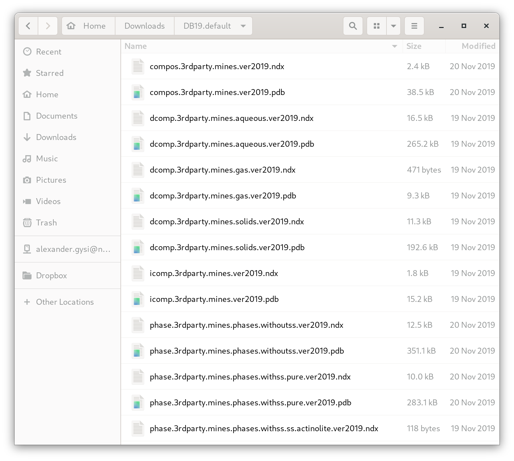
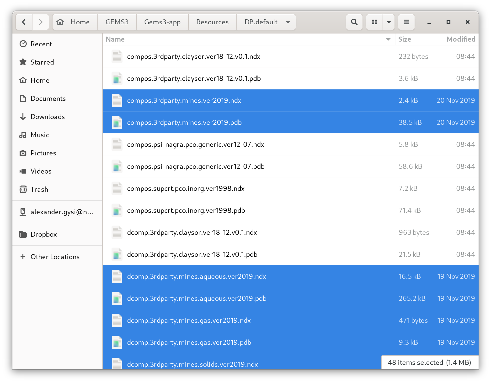
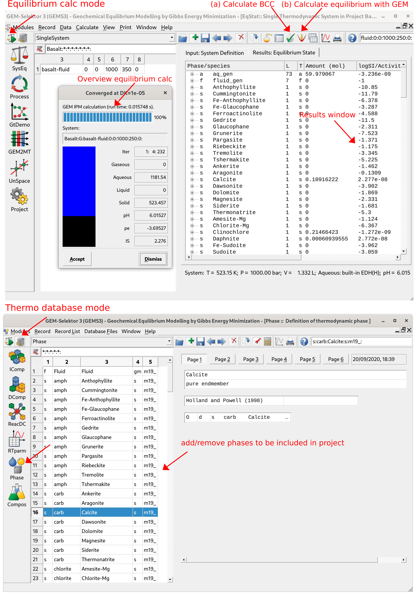

# Create your first project in GEMS {#intro}

 Here we will learn how to create a new Project, the selection of thermodynamic databases, components and equations of state for your modeling project. We will also explain the project folder structure and how to install the [MINES thermodynamic database](https://geoinfo.nmt.edu/mines-tdb) for modeling hydrothermal fluid-rock interaction and ore-forming processes . You will also learn how to interact basalt with water in your first equilibrium calculations.
 
## Installing the MINES thermodynamic database

The MINES thermodynamic database can be downloaded at https://geoinfo.nmt.edu/mines-tdb (Fig. \@ref(fig:fig-1)).


```{r,fig-1, echo = FALSE, out.width="90%", fig.cap="The MINES thermodynamic database webpage and files to download. Select the weblink for MINES19."} 
knitr::include_graphics("figures/module1/fig-1.png")
```


- Download and unzip the DB19.default archive folder to Downloads. Select all the database files in this folder and copy them (Fig. \@ref(fig:fig-2)).

- Merge these database files with the Gems3-app/Resources/DB.default folder by pasting them into DB.default (Fig. \@ref(fig:fig-3)). 
 	
-- In Linux this folder is in /Gems3-app/Resources/DB.default 

-- In Mac OSX this folder is in /Applications/gems3 then right-click show package content and go to Contents/Resources/DB.default

-- In Windows Gems 3.7, this folder should be in GEMS370/Gems3-app/Resources/DB.default. 
 	
The folder structure of the GEMS program, independent of the operating system used, consists of two main folders: 

- Gems3-app
    + The GEMS3-app folder contains the program resources and also a subfolder Resources/ DB.default, which will be used to copy the MINES thermodynamic database files into it. 

- Library/Gems3/projects
    + The projects folder will contain all the projects you create and work on, and will also be the folder in which you can copy the tutorial folders. 
 	
 ```{r,fig-2, echo = FALSE, out.width="70%", fig.cap="Unzipped DB19.default folder and database files to copy."} 

```

```{r,fig-3, echo = FALSE, out.width="70%", fig.cap="Database files merged with the Gems3-app/Resources/DB.default folder in GEMS."} 

```	

 
## Creating a new project from scratch

- Once you copied the database files, close GEMS. Open GEMS and click `New Project` in the Modeling Projects window. Give a name to your project (no spaces). The user interface is shown in Figure \@ref(fig:fig-4). Note if you run into display problem on high dpi screens (4K), I suggest to change the display resolution (e.g. to 1920 x 1080) and restart gems. 
 
- In the next window, you can choose the thermodynamic database for your project.	Select the database files 3rdparty/MINES and support, then deselect other databases as shown in Figure \@ref(fig:fig-5). Click `Next`.
 	
_Do not forget, you have an extensive list of minerals included in this database. Once you have gone through the tutorials and are familiar with GEMS, it is suggested that in thermodynamic database mode you switch to the `Phase` module (Fig. \@ref(fig:fig-9)), and remove minerals that are not relevant for your own specific project. Also, for less advanced users, it is easiest to not use the ternary non-ideal feldspar solid solution model (ss) but only their end members (i.e., anorthite, albite and microcline)._


```{r,fig-4, echo = FALSE, out.width="70%", fig.cap="GEMS user interface showing the project window. Click on make a `New Project` and select a project name without spaces."} 
knitr::include_graphics("figures/module1/fig-4.png")
```

```{r,fig-5, echo = FALSE, out.width="70%", fig.cap="Select 3rdparty/mines and support, and for phases select only withoutss. Note that we recommend only advanced users to choose withss; the expanded tab shows pure for endmembers and ss for different solid solution endmembers"} 
knitr::include_graphics("figures/module1/fig-5.png")
```
 	
 
- In the next window choose your system components: H-O-C-Cl-Na-K-Ca-Mg-Al-Fe-Si-Ti (Fig. \@ref(fig:fig-6)). Have you checked you got all of the elements selected? Check again please, then click `Next`...By doing so, GEMS will automatically look up all phases with these components in the MINES database and copy them into your modeling project!   _Tip of the day: all your modeling projects you are working on are located under Library/Gems3/projects. Make sure to do regular backups..._

	
- In the next window you will be able to choose the activity model for your aqueous speciation calculations (e.g. "Debye-Hückel", Davies equation, ...), and the EOS for gases. For now, follow Figure \@ref(fig:fig-7) using the extended "Debye-Hückel" equation (Helgeson), check the parameters and click `Check` for the aqueous speciation model. _This model is ideal for modeling H$_2$O-NaCl aqueous solutions (with NaCl as background electrolyte) at hydrothermal conditions at relatively moderate salinities observed in many ore deposits._

- Then you can switch to the gas EOS model tab and choose the Peng-Robinson-Stryjek-Vera (PRSV) model and click `Check` (Fig. \@ref(fig:fig-7)). That's it, now you are ready to model your first equilibrium model!

_Note: this model is for non-ideal gases, and for this purpose a new phase with the acronym (f) was added to the MINES database with all the relevant parameters using the PRSV EOS. Else the choice would be the ideal gas law with a phase using the acronym (g)_

```{r,fig-6, echo = FALSE, out.width="80%", fig.cap="Select here the composition of the system. All phases containing these elements will automatically be loaded from the MINES database into your project."} 
knitr::include_graphics("figures/module1/fig-6.png")
```


```{r,fig-7, echo = FALSE, out.width="70%", fig.cap="Select here the activity model for aqueous speciation (a-d) and the EOS model for gases (e-g)."} 
knitr::include_graphics("figures/module1/fig-7.png")
```

## Your first fluid-rock equilibrium model

- In the next window, you will be able to define the name of your first fluid-rock system equilibrium (`SysEq`) calculations and set the pressure and temperature (Fig. \@ref(fig:fig-8)).  

- Add a name without spaces and P-T conditions, i.e. we choose basalt-fluid, 250 $^{\circ}$C for T and 1 kbar for P. 
	
- Next window we select our ingredients and add 1000 g of H$_2$O (Aqua), 200 g of NaCl, 5 g Gas CO$_2$ and 500 g of basalt (Fig. \@ref(fig:fig-8)). Click `OK`.
	
- Finally, you can click on `Calculate BCC` followed by `Calculate equilibrium with GEM` as shown in (Fig. \@ref(fig:fig-9)). You can easily create another system by selecting `Clone a new record from this one` and change the fluid/rock ratio or temperature and see what what happens with the results. 


```{r,fig-8, echo = FALSE, out.width="70%", fig.cap="GEM-Selektor user interface showing the windows to create a new equilibrium system and define pressure (P) and temperature (T) for our first calculation."} 
knitr::include_graphics("figures/module1/fig-8.png")
```

```{r,fig-9, echo = FALSE, out.width="70%", fig.cap="GEM-Selektor user interface showing how to `Calculate BCC` followed by `Calculate equilibrium with GEMS`. Also shown are the `Equilibrium Calculation` mode and the `Thermodynamic database` mode, where you can inspect the MINES database."} 

```

## Outcomes

Congratulations! In Module 1 you learned how to install the MINES thermodynamic database in your Resources/DB.default GEMS folder, the general folder structure of GEMS, how to setup your first project and how to run your first fluid-rock equilibrium calculations in GEMS.
