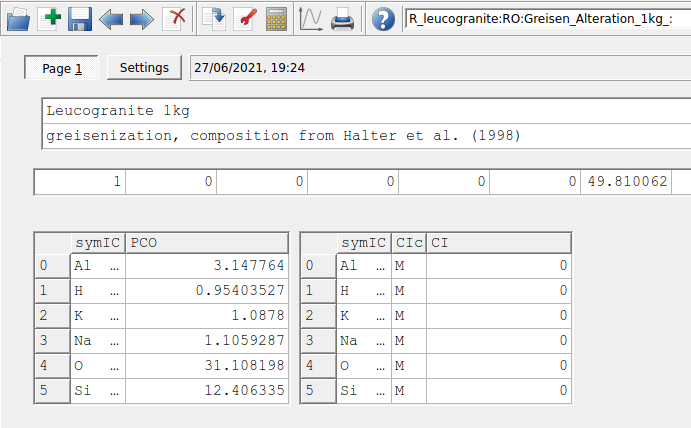

# Greisenization Part (I) {#module3}

In this module you will model the reaction path of a leucogranite during greisenization and evaluate the solubility of tin (Sn). We will learn how to: a) create `Predefined Composition Objects` (a rock or fluid composition), b) add new minerals or aqueous species to your thermodynamic database and c) simulate a more complex fluid-rock reaction path using our knowledge gained from [Module 2](#module2). The example follows a modeling study of the East Kemptville tin deposit from Halter et al. (1998), Chem. Geol. 150, 1-17. We will use the GEMS project file "Module3" that can be found either in the /Tutorial/Module3 workshop folder or download it directly [here](https://geoinfo.nmt.edu/mines-tdb/GEMS-files/Module3.zip).

## Create a custom rock  and fluid 

```{r,fig-1c, echo = FALSE, out.width="100%", fig.cap="GEMS user interface in Thermodynamic Database Mode. For adding a fluid or a rock choose Compos in Panel 2. For adding a mineral and/or aqueous species to your database choose DComp or ReacDC in Panel 2."} 
knitr::include_graphics("figures/module3/fig-1.png")
```

- Copy the entire unzipped Module3 folder into your GEMS project directory located in Library/Gems3/projects. More information on the GEMS folder structure can be found in [Module 1](#intro).

- Open GEMS, choose the project and switch to the `Thermodynamic Database Mode` and select in Panel 2 the option `Compos` for creating a predefined composition object (PCO). The user interface is shown in Figure \@ref(fig:fig-1c). 

- Select the record "Fluid_greisen". In this example the fluid was already prepared for you. GEMS is versatile in the way one can add the composition of a fluid or a rock. The fluid in this example was added using independent components (`IComp`), meaning single elements. You can check this by clicking on the wrench symbol (`Remake`) and inspect the selection. It is also possible to input minerals or custom chemical formula, for example if we would like to add 1 kg of H$_{2}$O to this system we could define a user-defined formula; more on this later.

- Data input/output windows are shown in Figure \@ref(fig:fig-1c) using mole units (M). Other units such as molality (m, mol/kg H2O) or ppm can be defined. The normalization factor can be chosen so that the output windows shows the mole elements for 1 kg of substance (or adding a 0 would not yield any normalization).  

```{r,fig-2c, echo = FALSE, out.width="80%", fig.cap="Parameters for creating a rock as PCO."} 
knitr::include_graphics("figures/module3/fig-2.png")
```
```{r,fig-3c, echo = FALSE, out.width="90%", fig.cap="Options for adding chemical components for a PCO. These include \texttt{Independent Components} (e.g. Al, K, Na), \texttt{Dependent Components} (e.g. microcline, quartz, H$_2$O) or user-defined formulae. "} 
knitr::include_graphics("figures/module3/fig-3.png")
```
- To create the rock click on `Clone a new record` in Panel 1. Fill the parameters as shown in Figure \@ref(fig:fig-2c). 

- On the next dialog select "Use formulae of Dependent Components" (Fig. \@ref(fig:fig-3c)). In the next dialog choose first independent components IComp (i.e., K, Al, Si, O, H, Na) then the dependent components `DComp`: Microcline, Muscovite, Albite and Quartz (Fig. \@ref(fig:fig-4c)).

- Select the `Settings` tab and fill out the amounts of `DComp` as shown in Figure \@ref(fig:fig-5c). Select the `Page 1` tab, add information for this PCO and normalize it to 1 kg; add zero values for `IComp`. Press `Re-calculate` in Panel 1 and save; your output results should be the same as shown in Figure \@ref(fig:fig-6c).


```{r,fig-4c, echo = FALSE, out.width="90%", fig.cap="Dialog to select Dependent Components."} 
knitr::include_graphics("figures/module3/fig-4.png")
```
```{r,fig-5c, echo = FALSE, out.width="90%", fig.cap="Dialog to add amounts of Dependent Components. Note the units are here in wt. percent."} 
knitr::include_graphics("figures/module3/fig-5.png")
```

```{r,fig-6c, echo = FALSE, out.width="90%", fig.cap="Dialogue to add informations on the PCO and add its normalization value (i.e., 1 kg). Make sure to put 0 values in the input window on the right side for IComp if only the input of DComp should be used for your rock composition."} 

```

- Switch to the `Equilibria Calculation Mode` (Fig. \@ref(fig:fig-7c)) and stay in `SysEq` mode to calculate the equilibrium of a single system; GEMS will ask whether you want to proceed with adding the rock to your project. 

- Click on `Create a new record record from scratch`, give the system the following name "Greisen_Fl", and a temperature of 250 $^\circ$C and pressure of 4000 bar.

- In the `Open recipe dialog` add 200 g of rock (R_leucogranite) and 1000 g of fluid (Fluid_greisen). Calculate the equilibrium. 

- Clone this record and modify the system to 450 $^\circ$C and 4000 bar, calculate equilibrium.

- Now lets explore the detailed results by clicking on `Open EqDemo Window (GEM task results)` in Panel 1 just next to the `Calculate Equilibrium` button. The window is shown in Figure \@ref(fig:fig-8c). Use this detailed results window to explore the following few questions:

	-- What is the pH of this system? 
	
	-- How much Sn (molality) can you dissolve in this solution? 
	
	-- What is the major Sn aqueous species in your model? Following the paper by Halter et al. (1998), which Sn species might be missing in their study?
	
	-- Topaz is a common mineral found in Greisen. Here we only have the hydroxide (OH) endmember Topaz-OH, in the next section we will see how to add a mineral and aqueous species.

```{r,fig-7c, echo = FALSE, out.width="100%", fig.cap="Equilibria Calculation mode with Open Recipe dialog (can be accessed by pressing on the yellow vial in Panel 1) where you can add the amounts of rock and fluid."} 
knitr::include_graphics("figures/module3/fig-7.png")
```

```{r,fig-8c, echo = FALSE, out.width="100%", fig.cap="Open EqDemo Window (GEM task results) window: tab EqIC can be used to inspect the total dissolved molality of Sn (m\\_t column); EqPh tab gives information on the mass, volume, moles and saturation index (Fa) of cassiterite (SnO2); EqDC tab shows the activities and amounts of Dependent Components, for example Sn chloride aqueous species. The EqGen gives a general overview of pH, pe, ionic strength and gas fugacities (lgFug)."} 
knitr::include_graphics("figures/module3/fig-8.png")
```

## Add minerals and aqueous species to database
```{r,fig-9c, echo = FALSE, out.width="100%", fig.cap="Thermodynamic database mode showing DComp records and input fields for Topaz-F."} 
knitr::include_graphics("figures/module3/fig-9.png")
```

- Switch to the `Thermodynamic Database Mode` and select in Panel 2 (left side) the option `DComp` for adding a new mineral phase. Select the records Topaz-OH or Topaz-F and check the inputs. Figure \@ref(fig:fig-9c) shows the `Page 1` input tab for Topaz-F. I already added this mineral for you but will briefly explain how to create such a record. Note the heat capacity function (Cp) can be set in the `Page 2` tab of this window.

- The easiest way would be to clone an existing record, for example Topaz-OH, choose the adequate thermodynamic model for P-T corrections, and then update the thermodynamic properties (G, H, S, Cp function and V). Here few more infos:

-- Once every field is complete, click on `Re-calculate and check record data` on the top Panel 1; GEMS checks for internal consistency of your data, for example you can enter only G and S, and the program will re-calculate the H value.

-- To inspect the Topaz-F record you can select it and click on the red wrench next to the calculator on the top Panel 1. There you can explore different model options and come back to the main `DComp` window (Fig. \@ref(fig:fig-9c)). 

-- The top part of the window needs a mineral name and the chemical formula; the {} brackets are used to indicate a mixing site, i.e. Topaz can mix OH and F on this crystallographic site. 

-- Scroll through the list of mineral records, one can see that "s" is used for solids, "f" for a fluid (i.e. non-ideal gas), and "a" for aqueous species. There you can explore for example the Al(OH)2+ species and see a typical set up for entering the temperature and pressure corrections for aqueous species.

```{r,fig-10c, echo = FALSE, out.width="100%", fig.cap="Thermodynamic database mode showing the Phase records option for creating mineral. The selected record shows the input parameters for the newly created ideal solid solution between Topaz-OH and Topaz-F with (1) name of phase, (2) selected mineral endmembers of the solid solution and (3) code for defining junior and major mineral (reserved for non-ideal solid solution)."} 
knitr::include_graphics("figures/module3/fig-10.png")
```

```{r,fig-11c, echo = FALSE, out.width="70%", fig.cap="Datafields for creating a Phase record."} 
knitr::include_graphics("figures/module3/fig-11.png")
```

```{r,fig-12c, echo = FALSE, out.width="70%", fig.cap="Selection of phase or phase endmembers for solid solutions. For a Topaz solid solution we select the OH and F endmembers"} 
knitr::include_graphics("figures/module3/fig-12.png")
```

- The final step to have the new mineral phase appear in our project consists in adding a phase record in the `Phase` option (Fig. \@ref(fig:fig-10c)). 

- Select the Topaz-OH record and click `Clone a new record` in Panel 1. Fill the parameters listed in Figure \@ref(fig:fig-11c). 

- Click next and select the mineral(s) for which you want to create a new phase. Here we select both Topaz-OH and Topaz-F for a binary solid solution (Fig. \@ref(fig:fig-12c)). Note that if we would like to only add a pure phase we select only one mineral in this menu. The resulting phase record should be similar to  Figure \@ref(fig:fig-10c).

- The last step is to switch to the `Equilibria Calculation Mode`, accept addition of the newly created phase and re-calculate the equilibrium of your two records created previously at 250 and 450 $^\circ$C and 4000 bar. Now expand the Topaz solid solution, congratulation you just formed topaz! See also Figure \@ref(fig:fig-13c).

```{r,fig-13c, echo = FALSE, out.width="100%", fig.cap="Equilibria Calculation mode showing the calculated composition of a topaz solid solution (Topaz-OH and Topaz-F)."} 
knitr::include_graphics("figures/module3/fig-13.png")
```

## Titration of leucogranite to greisen fluid
```{r,fig-14c, echo = FALSE, out.width="70%", fig.cap="Select a parent chemical system (`SysEq`) for modeling a `Process`."} 
knitr::include_graphics("figures/module3/fig-14.png")
```

- Switch to the `Equilibria Calculation Mode`, since we have already computed a  single system chemical equilibrium we can go ahead and select the option `Process` in Panel 2.

- `Create a new record from scratch` and select "Greisen_Fl, 4000, 250" as your parent chemical system record (Fig. \@ref(fig:fig-14c)). Note that the parent chemical record needs to contain the fluid and the rock to be titrated with the correct units (double check in `SysEq`).

- Create a titration model similar to Module 2 for the feldspar reaction path, except this time we will choose "R_leucogranite" as the titrant. The simulation conditions will be 250 $^\circ$C and 4000 bar, and we will add 0.1 g to 2000 g of R_leucogranite to Fluid_greisen. Figures \@ref(fig:fig-15c), \@ref(fig:fig-16c), and \@ref(fig:fig-17c) show the parameters to be entered in the subsequent `Process` wizard windows. Don't forget to un-tick the box "Save generated SysEq records" in Step 5 to avoid saving too many `SysEq` records. 

- Click `Next`, `Finish`, and save this record. 


```{r,fig-15c, echo = FALSE, out.width="70%", fig.cap="Name the `Process` simulator and indicate the model type."} 
knitr::include_graphics("figures/module3/fig-15.png")
```

```{r,fig-16c, echo = FALSE, out.width="100%", fig.cap="Input parameters for a titration model of a rock (R\\_leucogranite) reacting with a greisenizing fluid (Fluid\\_greisen). (1) Select titration mode (Titration cNu linear), (2) titrant, (3) amount of rock to add, and (4) P-T conditions."} 
knitr::include_graphics("figures/module3/fig-16.png")
```

```{r,fig-17c, echo = FALSE, out.width="100%", fig.cap="Choose the results to be plotted. Here we choose the mass minerals (in gram) using phM."} 
knitr::include_graphics("figures/module3/fig-17.png")
```

- Back to the main `Process` simulation window, check the `Controls` tab as shown in Figure \@ref(fig:fig-18c).

- Switch to the `Sampling` window and choose cNu  (i.e. amount of rock added) instead of J as shown in Figure \@ref(fig:fig-19c). Make sure to click on an empty area outside the script box followed by save for GEMS to register the change. 

- Switch now to the `Results` tab, click `Re-calculate` on Panel 1 and inspect the calculated results. Make sure to save the changes.

```{r,fig-18c, echo = FALSE, out.width="100%", fig.cap="`Controls` tab showing the parameters to set up a `Process` simulation for a titration model at 250 °C and 4kbar. Before plotting your results, (1) check you calculation control (P-T-x) script, then (2) switch the tab to `Sampling` and choose cNu for extent of reaction (amount of rock added) for the x-axis, (3) Re-calculate (numerical results can be viewed in the `Results` tab). To visualize the plot click on the plot symbol on Panel 1. To change model parameters click on Remake."} 
knitr::include_graphics("figures/module3/fig-18.png")
```


```{r,fig-19c, echo = FALSE, out.width="80%", fig.cap="`Sampling` tab showing the script to extract values for the x-y axis. Change here the `xp[J]` variable to cNu, i.e. we assigned this variable to the amount of rock (R\\_leucogranite) added to the system at each step. See also the script in the `Controls` window."} 
knitr::include_graphics("figures/module3/fig-19.png")
```

- Lets plot the results using the Plot dialog in Panel 1 (Fig. \@ref(fig:fig-18c))

- Select `Customize` at the bottom of the plot and use the parameters shown in Figure \@ref(fig:fig-20c). We can enter 0-2000 g for the x-axis and 0-815 g for the y-axis. Under `Fragment` enter 0-0.5 g for the y-axis. 

- The final titration models should look similar to Figures \@ref(fig:fig-21c) and \@ref(fig:fig-22c). By customizing the inset view of the graph (Fragment option) it is possible to inspect the stability of cassiterite and topaz  in more detail. 

- You can also create additional plots to investigate for example the Sn speciation, pH, etc. by cloning the existing records and change the plotting parameters. Simply click `Remake` (red wrench) in Panel 1 (Fig. \@ref(fig:fig-18c)) and select the sampling parameters in Step 3 of the `Process` wizard. Additional modeling results are shown in Figure \@ref(fig:fig-23c) to give you some inspiration!

- Finally note: always inspect your script in the `Controls` and `Sampling` tabs to make sure your set up is ok.
 
-- Note what happens to cassiterite, pyrrhotite and topaz from 450 to 250 $^\circ$C?

-- Do you recognize different alteration styles commonly observed in ore deposits?

-- Compare your simulations to Figs. 2 and 4 in the paper from Halter et al. (1998). What is the difference in mineralogy vs. reaction progress (rock added)?

-- Give three factors that can affect cassiterite (SnO$_2$) precipitation and Sn mobility in a hydrothermal fluid. 


	
```{r,fig-20c, echo = FALSE, out.width="100%", fig.cap="Plot dialog showing the parameters for x-y axes for the main Graph and the inset view using Fragment. This dialog can be accessed from the `Customize` button."} 
knitr::include_graphics("figures/module3/fig-20.png")
```
	
```{r,fig-21c, echo = FALSE, out.width="80%", fig.cap="Simulated leucogranite titration model showing the stable minerals (g) in equilibrium with a greisenizing fluid at 250 °C and 4000 bar as a function of Rock (g leucogranite) added. Comparison with Figure 2 in the Halter et al. (1998) paper indicates that our overall simulated mineralogy is similar to the progression one can expect to find in natural greisen. This progression goes from a quartz vein towards a qtz-greisen, qtz-topaz-greisen, qtz-sericite greisen, to a leucogranite."} 
knitr::include_graphics("figures/module3/fig-21.png")
```
```{r,fig-22c, echo = FALSE, out.width="80%", fig.cap="Graph inset view of the leucogranite titration model at 250 °C and 4000 bar. Note certain minerals included in the calculations (e.g., magnetite and annite) were not displayed in this and previous graphs. Comparison with Halter et al. (1998) indicates that our simulated mineralogy is similar to what we find in natural greisen. The control on mineralogy can by explained by the acidity of the fluid that will also control Sn mobility. Looking at a vein alteration halo, the system changes from a fluid buffered pH (center of the quartz vein) towards a more rock buffered pH (towards the leucogranite), which is expressed in the tiration model by the increased amount of leucogranite added to the fluid (progress extent). Additional plots are necessary to show the full complexity of this system as shown below."} 
knitr::include_graphics("figures/module3/fig-22.png")
```
```{r,fig-23c, echo = FALSE, out.width="80%", fig.cap="Simulated leucogranite titration model showing the log activity of aqueous Sn species vs. pH at equilibrium with a greisenizing fluid at 250 °C and 4000 bar. Similar to the feldspar reaction path (Module 2), adding rock to the fluid will lead to an increase in pH and a corresponding decrease in Sn mobility. These simulations highlight the importance of pH and salinity for the speciation of Sn and the solubility of cassiterite. "} 
knitr::include_graphics("figures/module3/fig-23.png")
```


## Outcomes
In this module you looked into the `Thermodynamic Database` mode and learned how to create a fluid and a rock (`PCO`). You also learned how to set up a `Phase` record such as a topaz solid solution and how to inspect thermodynamic data for minerals and aqueous species in `DComp`. You can now also set up different titration models with complex fluid and rock compositions, and design selected plot types for data interpretation. This module also highlights the importance of comparing the model with natural ore-forming systems. 

