---
output:
  pdf_document: default
  html_document: default
---
# Greisenization Part (II) {#module4}
In this module we will continue simulating the alteration of leucogranite during greisenization and Sn mobility. You will learn how to set up an open system `Process` simulation using the single flow-through reactor (R) mode. This mode is the simplest implementation of reactive transport in one box or cell. This is generally a good start before starting more complex 1-D reactive transport simulations using sequential reactors (multiple boxes or cells) such at those implemented in the GEMS2MT module.

```{r,fig-1d, echo = FALSE, out.width="100%", fig.cap="Conceptual models showing the two Process simulation types Leaching and Flushing in the single flow-through reactor (R) mode. "} 
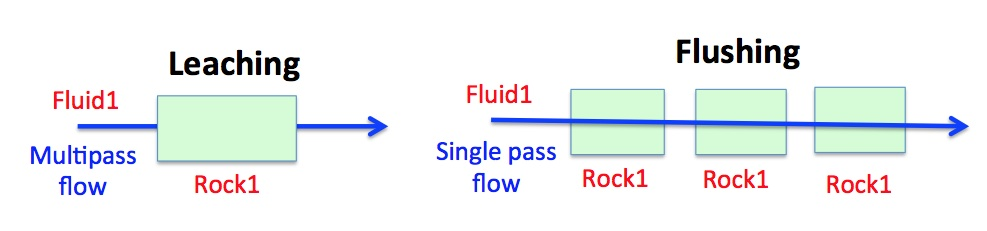
```

You will learn about two simulations types that can be set up in the single flow-through reactor (R) mode (from the GEMS help files):

- In the "Leaching" mode, at each pass (i.e. Process step), one can follow how the solid part evolves while reacting with a "fresh" fluid of constant composition.  

- In the "Flushing" mode, at each pass (i.e. Process step), one can follow how the fluid part evolves while reacting with the "fresh" solid part of constant composition .

We will use the GEMS project file "Module4" that can be found either in the /Tutorial/Module4 workshop folder or download it directly [here](https://geoinfo.nmt.edu/mines-tdb/GEMS-files/Module4.zip). Note that if you completed successfully Module 3, you can continue using this project for Module 4. 

## Multi-pass (leaching) model
A multi-pass model consists of consecutive batches of fresh (unreacted) greisen fluids (Fluid 1) reacting with a leucogranite (Rock 1) to simulate the alteration mineralogy during the formation of a hydrothermal quartz vein and alteration halo in the granite. This model can be set up using the R mode in `Process` simulation and choosing the leaching modeling scenario  (Fig. \@ref(fig:fig-1d)).


To set up such a model, we need a PCO for the rock (R_leucogranite) and fluid (Fluid_greisen), which were already prepared in Module 3, and we need to create a parent system equilibrium record.

- Create the parent system records in `SysEq` by cloning the two records you already created in Module 3; Greisen_Fl records at 250 and 450 $^\circ$C and 4 kbar. Rename these system records to "Rock_leach", and leave all the other parameters. For the input take for now 100 g of fluid and 1000 g of rock using the  `Open recipe dialog` (Fig. \@ref(fig:fig-2d)). Calculate the equilibrium. Save.

```{r,fig-2d, echo = FALSE, out.width="100%", fig.cap="Create two new parent equilibrium systems containing the fluid (F-greisen 100 g) and rock (R\\_leucogranite 1000 g) by cloning the Greisen\\_Fl records."} 
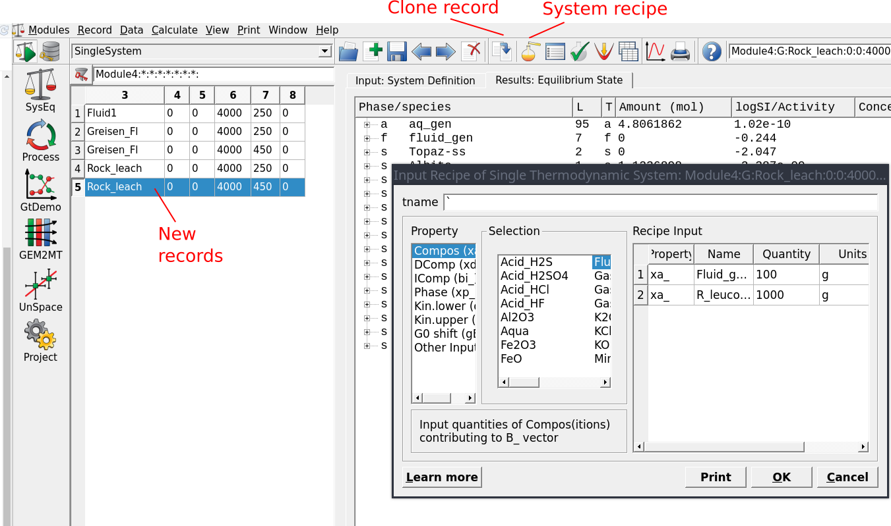
```


- Switch to `Process` simulation and clone your record built for the titration model in Module 3. Select your parent chemical system equilibria record "Rock\\_leach" at 450 $^\circ$C (Figs. \@ref(fig:fig-3d)).

- Name the simulation task "Rock-leaching\\_450C" and use as simulation code R this time instead of S (Figs. \@ref(fig:fig-4d) and \@ref(fig:fig-5d)).


- In the next window tick the option "Leaching: Compos source", select the fluid (Fluid\\\_greisen), then select the rock (R\\\_leucogranite) as illustrated in Figure \@ref(fig:fig-6d). Make sure to the follow the exact sequence so the script generated by the wizard will work automatically.


- Click Next... Finish. 

```{r,fig-3d, echo = FALSE, out.width="100%", fig.cap="Selection of parent system equilibrium records for setting up a new Process simulation. Note to create a new Process record clone an existing Greisen\\_titration model already created in Module 3."}
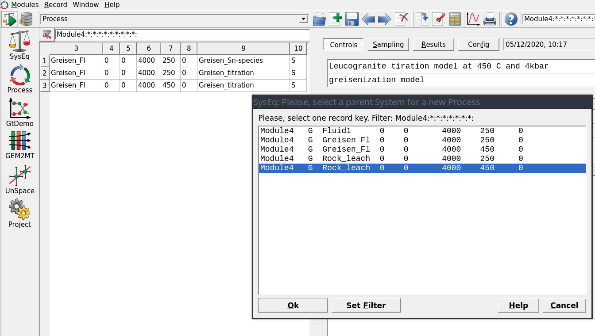
```

```{r,fig-4d, echo = FALSE, out.width="70%", fig.cap="Create a new record for a Process simulation in R mode."} 
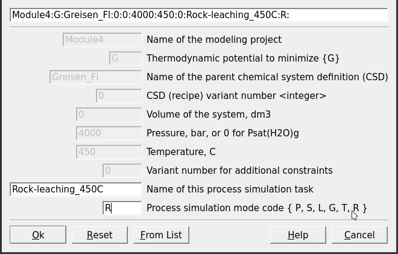
```
```{r,fig-5d, echo = FALSE, out.width="90%", fig.cap="Select the simulation in R mode for setting up either a leaching or flushing models."} 
knitr::include_graphics("figures/module4/fig-5.png")
```
```{r,fig-6d, echo = FALSE, out.width="100%", fig.cap="The Process dialogue for a multipass leaching model (mode R). To set up this system select Leaching (1), then the fluid (F\\_greisen) (2) and the rock (R\\_leucogranite) (3). Check that the definitions of your rock and fluid look similar to the script window (4). Select the number of fluid aliquots (5), i.e. 200 fluid aliquots (iTm: from 1000 to 1200 in steps of 1), and set P-T conditions (6). Note if we want to increase the number of fluid aliquots passing through the rock, we need to increase iTm for example from 1000 to 1400 in steps of 1 to create 400 aliquots. Also note that the fluid to rock ratio was set and can be changed in the parent SysEq record."} 
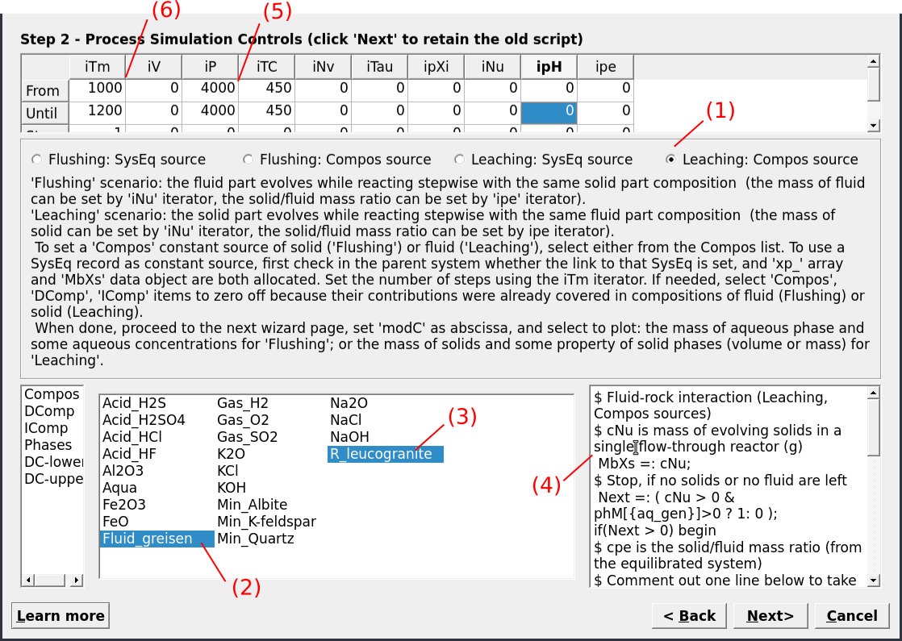
```

- Check the `Controls` window; the set up should look like Figure \@ref(fig:fig-7d).
 

- Switch the `Sampling` tab and select the variable "J" for the x-axis, which represents the number of fluid aliquots passed through the rock. Click on an empty area to register the change, then save the record and click \texttt{Re-calculate}.

- Plot the results and scale the x- and y-axis to inspect the results, which should look similar to Figure \@ref(fig:fig-8d). Note you can also modify the number of fluid aliquots by varying the number variable as indicated in Figure \@ref(fig:fig-6d), e.g. instead of 200 use 400 aliquots. Do not forget you need to use `Remake` to be able to do this, as in your `Results` tab the program will need to add 200 rows in the table, which cannot be done by only changing the numbers in the "Controls" tab window. 

- Try now to change the fluid/rock ratio, for example using 1000 g fluid and 1000 g rock (f/r of 1). To do this switch to `SyEq`, select the parent record and choose 1000 g fluid and 1000 g rock, calculate the equilibrium and save. Go back to the `Process` window and re-calculate the multipass leaching model. In the pop-up window select "Yes" to plot the graph during the simulations!

```{r,fig-7d, echo = FALSE, out.width="100%", fig.cap="Controls window showing the set up for a Process simulation in R mode for the leaching model at 450 °C and 4 kbar."} 
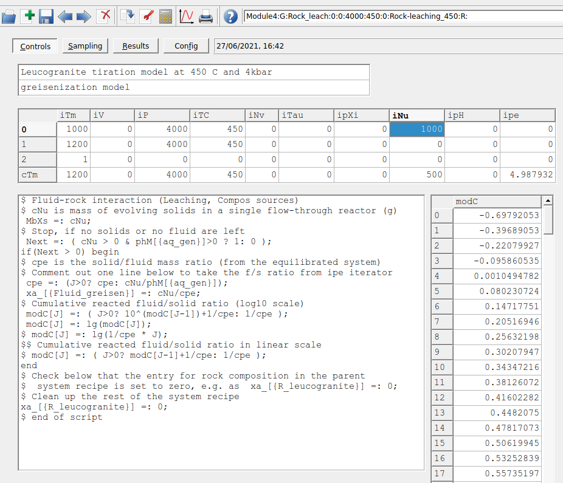
```

```{r,fig-8d, echo = FALSE, out.width="100%", fig.cap="Simulated leucogranite multipass leaching model showing the stable minerals (g) at 450 °C and 4 kbar as a function of fluid aliquots passed through the rock. The initial fluid/rock ratio (100/1000) of 0.1."} 
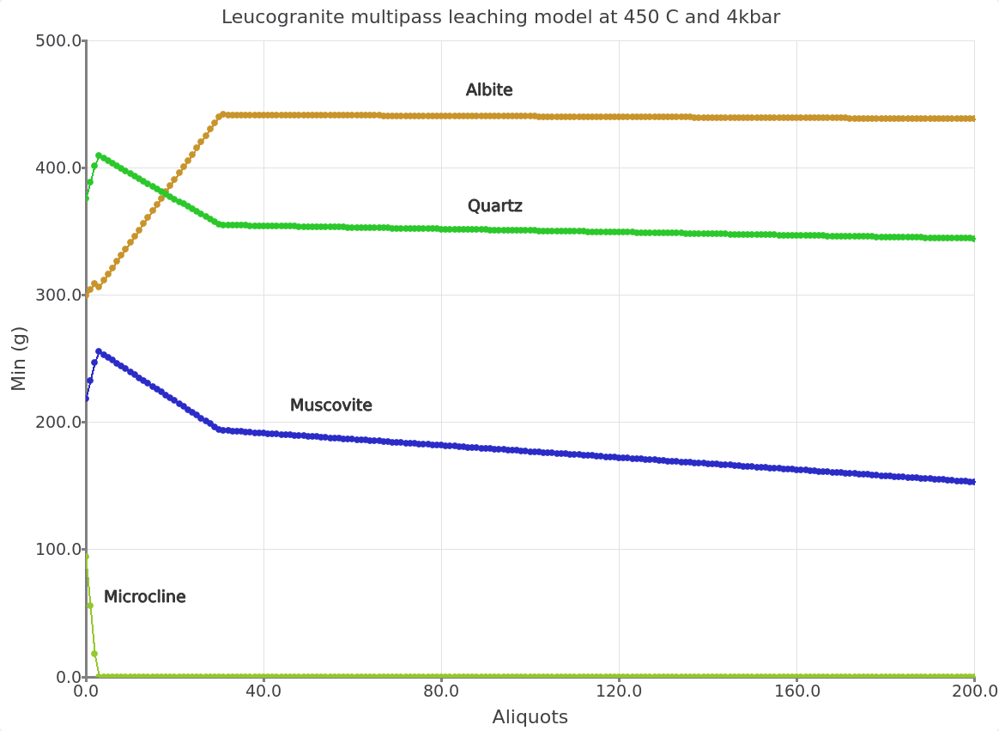
```
```{r,fig-9d, echo = FALSE, out.width="100%", fig.cap="Leucogranite multipass leaching model with a fluid/rock ratio (1000/1000) of 1."} 
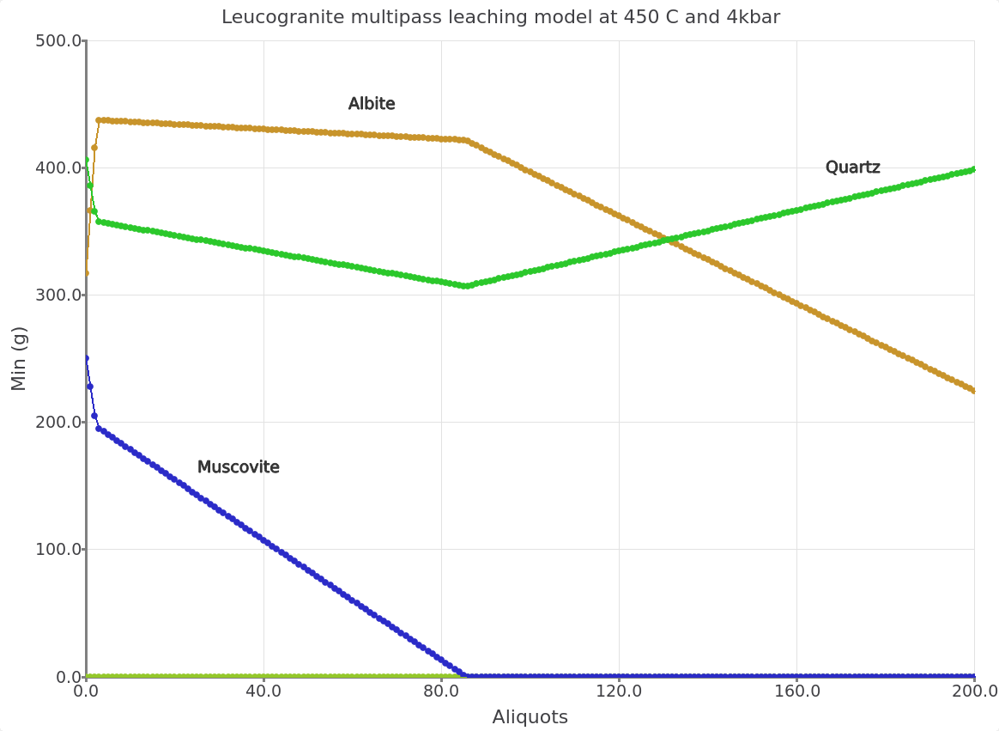
```

## Modify P-T of the leaching model

- To change the model temperature, we are now going to create a new "Rock\\_leach" simulation by cloning the Process record and selecting the correspond parent chemical system at 250 °C (Fig. \@ref(fig:fig-10d)). 

- Click next and Finish. 

- In the `Controls` window change the temperature to 250 °C. Make sure to save the record (Fig. \@ref(fig:fig-11d)). 

- Click `Re-calculate` and plot the results. The simulated mineralogy should be similar to Figures  \@ref(fig:fig-12d) and \@ref(fig:fig-13d).

```{r,fig-10d, echo = FALSE, out.width="70%", fig.cap="Selection of parent system equilibrium records for setting up a new multipass leaching model at 250 °C and 4 kbar."} 
knitr::include_graphics("figures/module4/fig-10.png")
```

```{r,fig-11d, echo = FALSE, out.width="100%", fig.cap="Controls window showing the set up for a Process simulation in R mode for the leaching model at 250 °C and 4 kbar."} 
knitr::include_graphics("figures/module4/fig-11.png")
```

```{r,fig-12d, echo = FALSE, out.width="100%", fig.cap="Simulated leucogranite multipass leaching model showing the stable minerals (g) at 250 °C and 4 kbar as a function of fluid aliquots passed through the rock. The initial fluid/rock ratio (100/1000) of 0.1."}
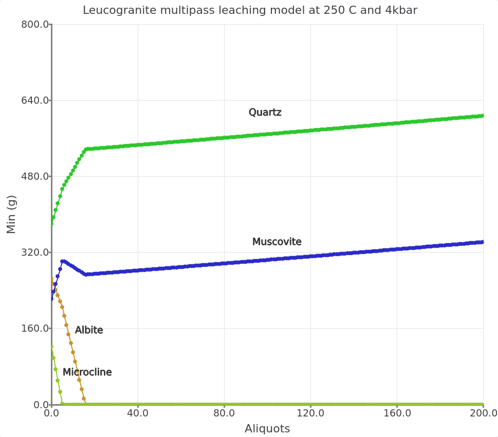
```

```{r,fig-13d, echo = FALSE, out.width="100%", fig.cap="Inset view showing the simulated leucogranite multipass leaching model at 250 °C and 4 kbar and initial fluid/rock ratio (100/1000) of 0.1."}
knitr::include_graphics("figures/module4/fig-13.png")
```

## Single-pass flushing and cooling model
This time we simulate the evolution of a single batch of fluid reacting progressively with more granite  upon cooling and look at the evolution of the fluid composition. The conceptual model is represented by a single-pass of a fluid interacting at each step with fresh granite.

This model can also be set up using the R mode in `Process` simulation and choosing the flushing modeling scenario (Fig. \@ref(fig:fig-1d)).

- Create the parent system records in `SysEq` by cloning the Rock\\_leach model created earlier at 450 °C and 4 kbar. Rename this system records to "Rock\\_flush", and leave all the other parameters (Fig. \@ref(fig:fig-14d)). 

- Calculate the equilibrium. Save.


```{r,fig-14d, echo = FALSE, out.width="100%", fig.cap="To set up a single-pass flushing model we need to create a parent chemical equilibrium system in SysEq by cloning an existing record."}
knitr::include_graphics("figures/module4/fig-14.png")
```

- Switch to `Process` simulation and clone one of the "Rock-leaching" models by electing your parent record "Rock\\_flush" created previously at 450 °C and 4 kbar   (Fig. \@ref(fig:fig-15d)).

- Call the new record "Rock-flushing-cool" and use the code R for the process simulation mode (Fig. \@ref(fig:fig-16d)).

- Change the system parameters in the next Process wizard window to cool your system from 450 down to 250 °C at 4 kbar. Select the "Flushing: Compos source" model and the other options shown in Figure \@ref(fig:fig-17d). Make sure to the follow the exact sequence so the script generated by the wizard will work automatically.

- In the following window select the sampling parameters. Here we will choose log of total dissolved Sn (lgm\\_t, molality) and log activity (lga) of the aqueous Sn species as shown in Figure \@ref(fig:fig-18d). 


```{r,fig-15d, echo = FALSE, out.width="100%", fig.cap="Select the parent record Rock\\_flush to create a new Process simulation by cloning on of the previously created Rock\\_leaching records."}
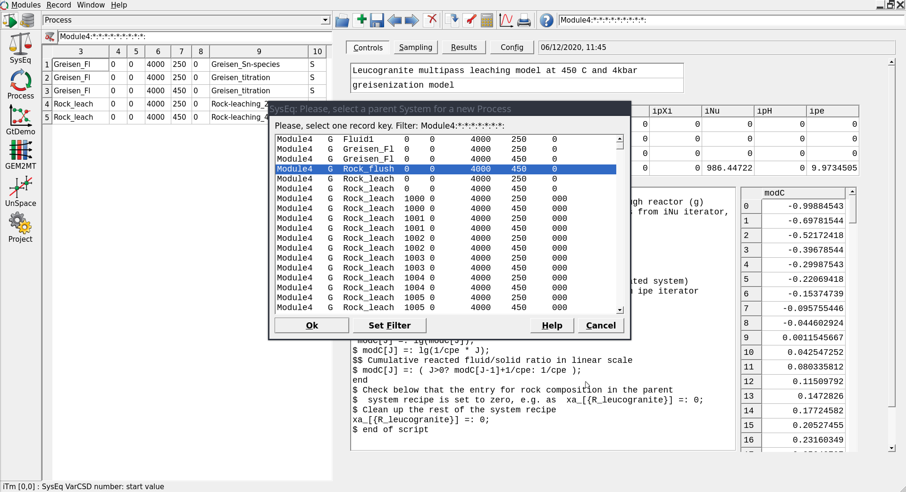
```

```{r,fig-16d, echo = FALSE, out.width="70%", fig.cap="Input window the create a record for the flushing model."}
knitr::include_graphics("figures/module4/fig-16.png")
```

```{r,fig-17d, echo = FALSE, out.width="100%", fig.cap="The Process dialogue for a single-pass cooling model (R). To set up this system select Flushing (1), then the rock (2) and (3). Check that the definitions of Fluidgreisen and R\\_leucogranite look similar to the script window (4). In (5) we select the temperature change between each rock column or step (i.e. from 450 to 250 °C  in -5 °C  steps). In (6) we select the number of rock columns (i.e. 40)."}
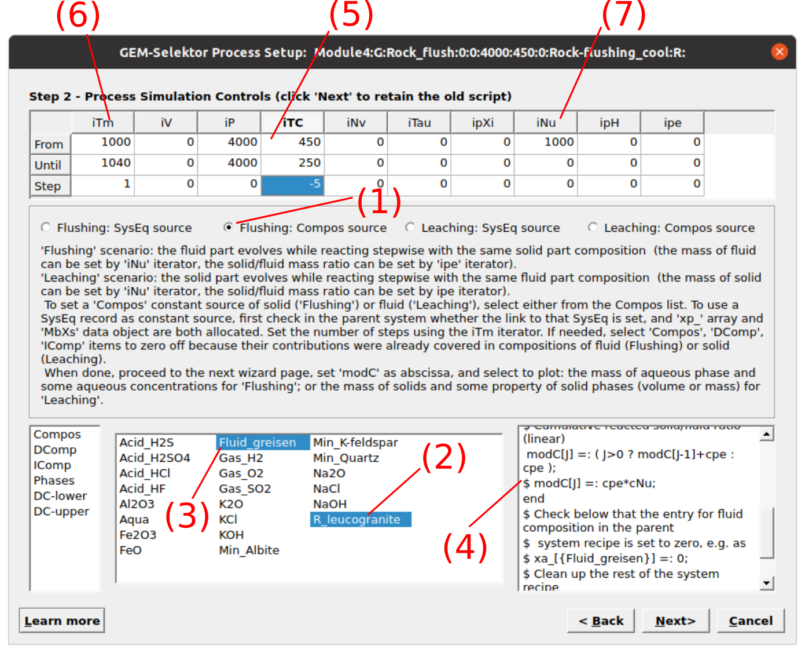
```

```{r,fig-18d, echo = FALSE, out.width="100%", fig.cap="Sampling dialog in the Process wizard for selecting the Sn species to be plotted."}
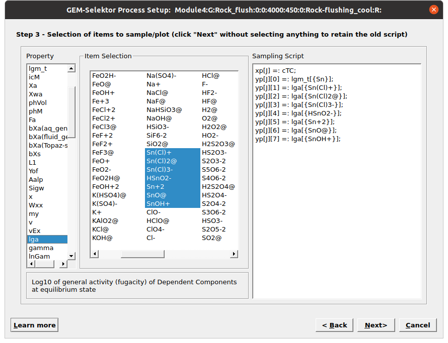
```

- Check the "Sampling" tab, if not the same use \texttt{Remake} to select the dissolved aqueous species to plot. Note for the x-axis we chose the temperature in $^\circ$C (cTC). 

- Finally, click \texttt{Re-calculate}. The results should look similar to \autoref{fig:fig11.jpeg}

```{r,fig-19d, echo = FALSE, out.width="90%", fig.cap="Controls tab showing the simulation parameters for the single pass flushing and cooling model."}
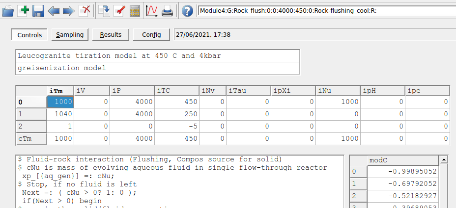
```
```{r,fig-20d, echo = FALSE, out.width="90%", fig.cap="Sampling tab show the script window. Make sure to enter cTC for temperature."}
knitr::include_graphics("figures/module4/fig-20.png")
```
```{r,fig-21d, echo = FALSE, out.width="90%", fig.cap="Single-pass flushing model showing the aqueous Sn species and total dissolved Sn concentrations in a greisen fluid reacted stepwise with leucogranite and cooled from  450 to 250 °C at 4kbar."}
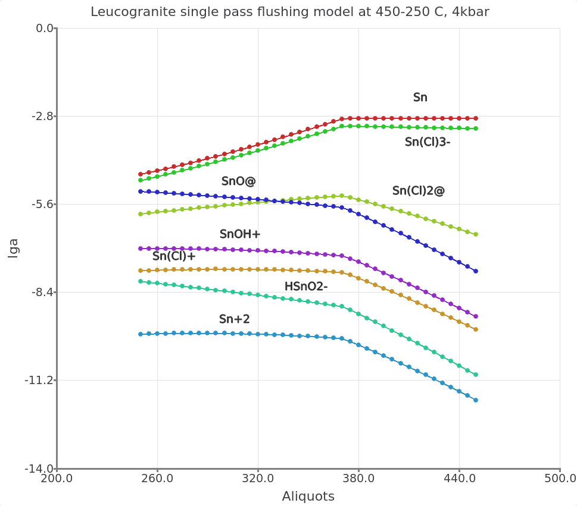
```