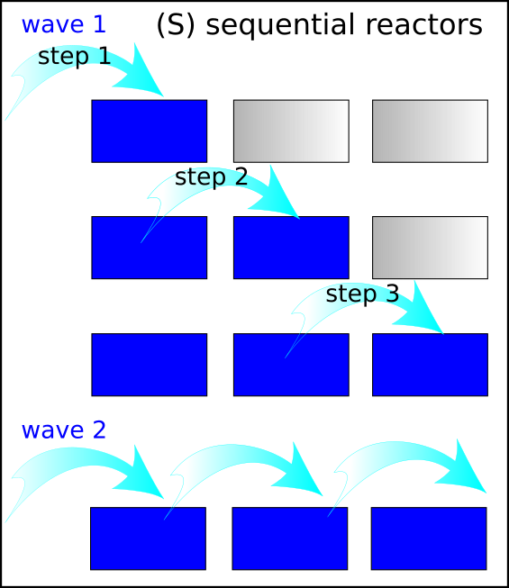
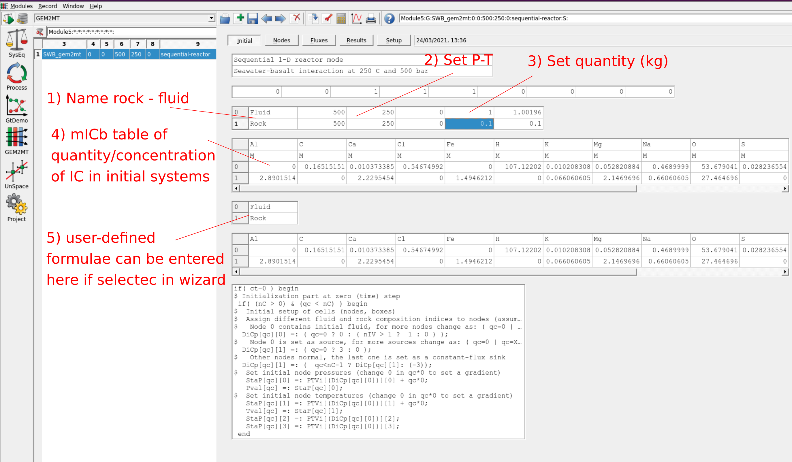
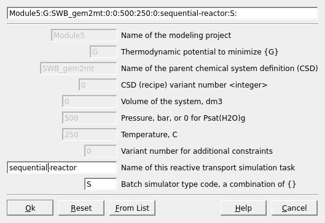

# GEM2MT reactive mass transport simulations of hydrothermal seawater-basalt interaction {#module5}

The GEM2MT module is a tool for automation of one-dimensional (1-D) reactive mass transport simulations coupled with GEM calculation of equilibrium states in spatially distributed nodes (boxes, volumes) over time steps. GEM2MT can be used to simulate the open system evolution and fluid-rock reactions occurring along a fluid flow path (e.g. vein, fracture, porous media, etc.). This type of simulation solves simple reactive mass transport problems, which requires the definition of fluxes between boxes of certain fluid/rock mass or volume ratios (or alternatively porosity and permeability) where fluid is moved sequentially or simultaneously from one box to the other. The GEM2MT module can simulate reactive transport in three main modes (see help file for more info):

- Sequential reactor chain and waves (S)
- Flow-through and box-flux sequence (F, B)
- One-dimensional reactive transport with advection/dispersion/diffusion (A,D,W)

To prepare for such simulations, two Compos (PCO) records are usually created in thermodynamic database mode. These two system compositions can then be copy/pasted and added later to GEM2MT, either using individual elements (Independent Components) and/or user-defined formulae units. In this example we use for Rock "R\_Basalt" and for Fluid "F\_Seawater" (already prepared in Module 5) and an example "SWB-reactor" was created in SysEq at 250 $^{\circ}$C and 500 bar.

## "Sequential reactors chain" S mode

In this mode, we can simulate a "wave" of a fluid that will pass through a series of 100 rock nodes once per step (i.e., a wave consists of ca. 100 substeps) with an initial fluid/rock ratio of 10. A schematic of the sequential reactors chain is shown in Figure \@ref(fig:fig-1e).

```{r,fig-1e, echo = FALSE, out.width="70%", fig.cap="Schematic showing the sequential reactors chain (S mode). A sequence of steps forms a wave where the fluid passes and equilibrates sequentially through all of the reactors in the chain until the fluid reaches the last reactor, at which point another wave starts in the first reactor."}

```


- Create a parent system record containing the 1000 g of the fluid and 100 g of the rock in SysEq at the temperature and pressure of interest (i.e. 250 $^{\circ}$C and 500 bar). This record will have to be selected when creating a new GEM2MT record (object) containing all the phases and elements relevant to the fluid-rock system of interest. Lets call this system "SWB\_gem2mt".


- Switch to the GEM2MT module and create a new record. Select the parent system containing the rock and the fluid created above. Call this record "sequential-reactor"

- In Step 1 of the wizard, select the S mode.

- In Step 2 of the wizard, set the number of nodes (nC= 101) and the maximum number of steps (in this case, "waves", i.e. 1000). Select 2 for the number of initial chemical system recipes, which will allow us to define the initial compositions and masses of the fluid and rock initial systems. _Optionally, we can set the number of user-defined formula units that will be used for augmenting initial bulk elemental compositions of the  fluid and the rock._ 

- In Step 3, we select "Move aqueous fluid".

- In Step 4, we select P, T, V, Initial system, Node type, MPG flux, and Initial mass.

- In Step 5, we select the variables you want to plot in each node after each "wave". Under n1vPH (volumes of minerals) select Cpx, Chlorite, Epidote, Calcite, Albite, Quartz, Prehnite, Wairakite, Anhydrite, Pyrite.


```{r,fig-2e, echo = FALSE, out.width="900%", fig.cap="GEM2MT module Initial window page showing the steps to set up 1) the initial name of rock and fluid, 2) pressure and temperature, 3) input quantity of rock and fluid in kg, 4) compositions of rock and fluid (i.e., row index 0 corresponds to the fluid and row index 1 to rock), and 5) input of additional user-defined formulae and units (these fields can be added/selected in the wizard window)."}

```


After completing the wizard, we get to the GEM2MT module window "Initial" page (Fig. \@ref(fig:fig-2e)). There we need to enter a comment about the simulation, the names of rock and fluid, temperature, pressure, mass of fluid and rock, and the initial composition of the fluid and the rock. 

- In the first row (index 0), enter the name of system "Fluid" or similar, and add a mass of 1 kg. In the second row (index 1), enter the name of system "Rock" or similar, and add a mass of 0.1 kg. In both cases, set temperature (e.g. 250 $^{\circ}$C) and pressure (e.g. 500 bar) for equilibrium conditions.

- Next in the mICb table below of quantity/concentration of IC in initial systems, enter (copy-paste) the concentration and units for each element to define the compositions of rock and fluid in the corresponding rows. _Optionally, type user-defined formulae (e.g. "SiO2", "CO2", etc.) and enter their units and quantities, which will be added (after unit conversions) to the bulk elemental compositions of initial systems for fluid and rock._

The initialization script (visible in the lower part of the "Initial" page) should have been created by the wizard and normally does not need editing in the S mode. Click the "Calculate" toolbar button and (at the very first time) do not plot the nodes. Stop calculation after a few "waves" and start it again with graph plotting to inspect the results.

## Flow-through reactors chain (F) mode

In this mode, we can simulate the simultaneous transport of (reacted) fluid in one direction through all nodes from one node to the next. This mode requires the definition of equal zero- and/or first-order fluxes of fluid connecting each node with the next one; equal rates of the fluid flux should be specified (in mass/time (step) units). In this example we will transport about 20 g fluid/step through each node simultaneously. The very first box in the chain is declared a "constant-flux source" and it contains only "fresh" fluid but no rock; the very last box is declared a "constant-flux sink".  

```{r,fig-3e, echo = FALSE, out.width="70%", fig.cap="Schematic showing the flow-through reactors chain (F mode). At each step a defined flux of fluid is pumped into the first reactor and the same amount of fluid out of the last reactor. In this simulation mode the same amount of fluid passes simultanously from one reactor to another with a flux/step corresponding to the fluid in/output flux."}

```

The initial setup for F mode is similar to that for S mode, with an important difference that the same mass of fluid (corresponding to the effective fluid/rock mass ratio) should be present in all nodes containing the rock at the initial step. In this example, we will start by adding 10 kg of H2O to 1 kg in our initial rock composition. Since we normalize the total rock to 0.110 kg during initialization, the starting composition of each node will be 100 g of H2O and 10 g of rock. At each (time) step, about one fifth of fluid in each box is transported to the next box, for this we will use a flux constant of 0.2. 

- Under GEM2MT, we create a new record (you can clone the record prepare in S mode) selecting the parent system containing the rock and fluid created in SysEq ("SWB\_gem2mt").

- In Step 1 of the wizard, we select the F mode.

- In Step 2 of the wizard, we set the number of nodes (e.g. nC= 101) and a maximum number of (time) steps (e.g. 1000). Enter 1 for the number of user-defined formula units (to add at least H2O to the rock initial composition).

- In Step 4, we set P, T, V, Initial system, Node type, MPG flux, and Initial mass.

- In Step 5, we select the output variables you want to plot in each nodes. Under n1vPH (volumes of minerals) select Cpx, Chlorite, Epidote, Calcite, Albite, Quartz, Prehnite, Wairakite, Anhydrite, Pyrite.

After completing the wizard, we get to the GEM2MT module window "Initial" page. There we need to enter the names of rock and fluid initial systems, their temperature, pressure, masses, and the initial compositions of the fluid and the rock (already done in Example 1). For the rock composition we will add 10 kg H2O (unit G) as a  user-defined formulae, which will be added (after unit conversions) to the bulk elemental compositions of initial systems of the rock. The rock should contain enough initial H2O to have the desired fluid/rock mass ratio (e.g. if normalized to 1 kg of rock, add 10 kg of H2O for a fluid/rock ratio of about 10). Also make sure to have all elements present in both the fluid and the rock, i.e. you can add a small amount (1e-9 moles) of C, Cl, and S to the rock and a small amount (1e-9 moles) of Al, Fe, Si and Ti to the fluid.

- The initialization script (visible in the lower part of the "Initial" page) should have been created by the wizard. In this script, we check that the Flux Rate (FDLf) is set to the desired value. This script will then assign a zero-order flux (0) from node 0 to 1 with a flux of 0.1, and assign a first-order flux (1) with a flux of 0.2 between all the other nodes (or boxes). A 1st order flux means that the mass (of fluid) transported per (time) step is proportional to the mass of fluid phase in the outgoing box.

The correspond script part that can be changed and initializes each node is the following:

```
$     flux order 1 (proportional to source MPG mass)
FDLf[qf][0] =: ( qf=0? 0: 1);
$     flux rate constant
FDLf[qf][1] =: ( qf=0? 1: 0.2);
```

- Switch to tab "Fluxes", there we need to set the amount of phase(s) that are transported in the flux in the first box. For defining unit flux as composed of 20 g aqueous solution phase, enter 0.02 G of aq\_gen phase for quantities of phases in MGP column (for a flux constant of 1). In the other boxes, a flux constant of 0.2, means that the mass of fluid transported between the boxes will be about 100g times 0.2 = 20g/step.

Click the "Calculate" toolbar button and (at the very first time) do not plot the nodes. Stop calculation after a few "steps", then start it again with plotting.

## One-dimensional reactive transport with advection/dispersion (A) mode

- Under GEM2MT, we create a new record  selecting the parent system containing the rock and fluid created in SysEq ("SWB\_gem2mt").
	
- In Step 1 of the wizard, we select the A mode.
	
- In Step 2 of the wizard, we set the number of nodes (e.g. nC= 101) and a maximum number of (time mTau) steps (e.g. 1000). Enter 1 for the number of user-defined formula units (to add at least H2O to the rock initial composition).
	
- In Step 4, in addition to default options in S and F modes, we choose Initial node volume, Advection veolocity, Init. node porosity, Init. eff. permeability, Init. media dispersivity.
	
- In Step 5, we select the output variables you want to plot in each nodes. 
	
-- After completing the wizard, we get to the GEM2MT module window "Initial" page. There we need to enter the names of rock and fluid initial systems, their temperature, pressure, masses, and the initial compositions of the fluid and the rock (similar to Example 2). For the mass of rock choose 1 kg. 
	
- The initialization script (visible in the lower part of the "Initial" page) should have been created by the wizard. Instead of defining fluxes, we will define advection velocity, porosity etc. To do this we switch to the "Nodes" tab and choose spatial dimension x  (e.g. 0.2 m), time step reduction factor 1,for initial node volume 1 m3, advection velocity 1e-07 m/s, porosity 0.3, permeability 1e-14, dispersivity 0.001 initial dispersivity 2e-9 m.
	
- Switch to tab "Setup", choose 1,000,000 for total time mTau and a step of 100.
	
-- Click the "Calculate" toolbar button and (at the very first time) do not plot the nodes. Stop calculation after a few "steps", then start it again with plotting.
	