# IOA Deposits - REE fractionation and apatite vein replacement reaction {#module7}

Iron Oxide-Apatite (IOA) systems (e.g. Kiruna-type) contain fluids rich in rare earth elements (REE) reacting with preexisting magmatic apatite and magnetite, triggering a destructive replacement texturally visible in ore deposits where fluorapatite is replaced by monazite/xenotime overgrowths and magnetite oxidizes/re-equilibrates to hematite. Figure xyz shows how this typical reaction would look like in a geochemical model. We are essentially looking at an irreversible reaction of the type:

$$\text{Apatite} + \text{Magnetite} \rightarrow \text{Monazite} + \text{Xenotime} + \text{Hematite}$$

```{r,fig-1a, echo = FALSE, out.width="80%", fig.cap="(left) Conceptual model of a single flow-through reactor representing a multipass leaching model of an IOA deposit. (right) The simulated reaction of apatite and magnetite to monazite and hematite using GEMS and the MINES database. From: Gysi, A.P., Hofstra, A.H., Harlov, D.E., Miron, G.D. (2019) Rare earth element (REE) metasomatism in iron-oxide-apatite mineral deposits: stability of hydrothermal monazite and xenotime. AGU Fall Meeting Abstracts, 2019, V33C-0244)."}
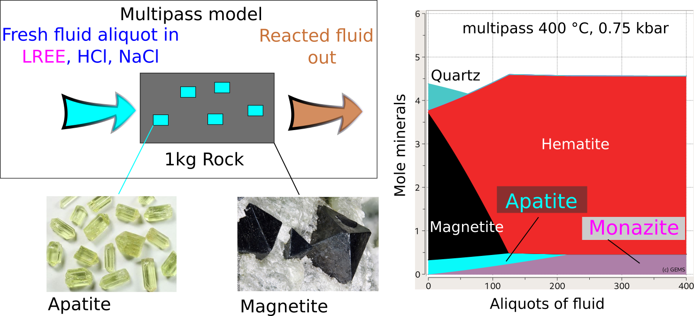
```

Monazite hosts the light REE and xenotime the heavy REE, and the fractionation of these two minerals is a key to understand the geochemical evolution of the ore-forming fluids. In this module we will learn how to set up a multipass leaching model using a Process Simulation representing an open vein system akin a reactive transport model but focusing on one box and without considering hydrologic parameters. The latter is a more advanced topic and will be covered in a future tutorial.

First we create the parent system in `SysEq` and use the 'R mode' in `Process` simulations to compute a multipass single flow-through reactor model. The case study involves calculation of the alteration assemblages and monitor the fluid REE concentrations to learn how to plot a sum of elements, prepare a REE-rich fluid as `PCO` in `Thermodynamic database mode`. We will also learn how to further analyze the model and create additional fluid compositions with varying initial pH.

## Create a parent record in the Ca-Fe-P-O-H-Cl-F-REE system

The first step is to setup a parent system record in `System Equilibrium` calculation mode (`SysEq`) using the project **Module 7** and calculate equlibrium to check the mineralogy, pH and aqueous speciation. 

- Select the `SysEq` option in the left panel and create and select 'Create a new record from scratch'. We will create a new record using a temperature of 100 $^\circ$C and a pressure of 1000 bar.  Let's call the record `Fl-Rock_IOA`

- For the input recipe we need to add our IOA deposit rock (60g Magnetite, 40g Fluorapatite), and our REE-bearing saline acidic fluid, see Fig. \@ref(fig:fig-1). The fluid recipe is as follows: 
    -  1 kg H~2~O
    -  1.0 M NaCl
    -  0.01 m HCl (pH ~2.0)
    -  100 ppm of each REE.
- Now calculate equilibrium and check the results. Fig. \@ref(fig:fig-2) shows the calculated pH and monazite/xenotime ideal solid solution compositions.

```{r,fig-1, echo = FALSE, out.width="80%", fig.cap="`SysEq` input for a new record and the fluid and rock compositions. This dialog can be reached by clicking on the yellow vial, make sure to select the correct property; for example use `DComp` to select magnetite and apatite then add the quantity and units; select `IComp` for individual REE and choose y for mg (ppm = mg/kg); choose `Compos` for custom records like Acid_HCl, H2O, and NaCl."}
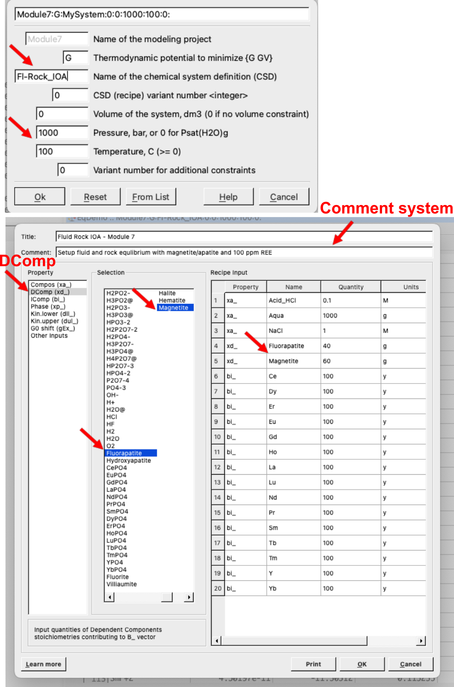
```
```{r,fig-2, echo = FALSE, out.width="90%", fig.cap="`SysEq` equilibrium calculation ouputs showing the record created, the yellow vial (Input recipe), and the results window with the compositions of ideal monazite and xenotime solid solutions, stable phases, and at the bottom pH, P-T, pe, and ionic strength."}
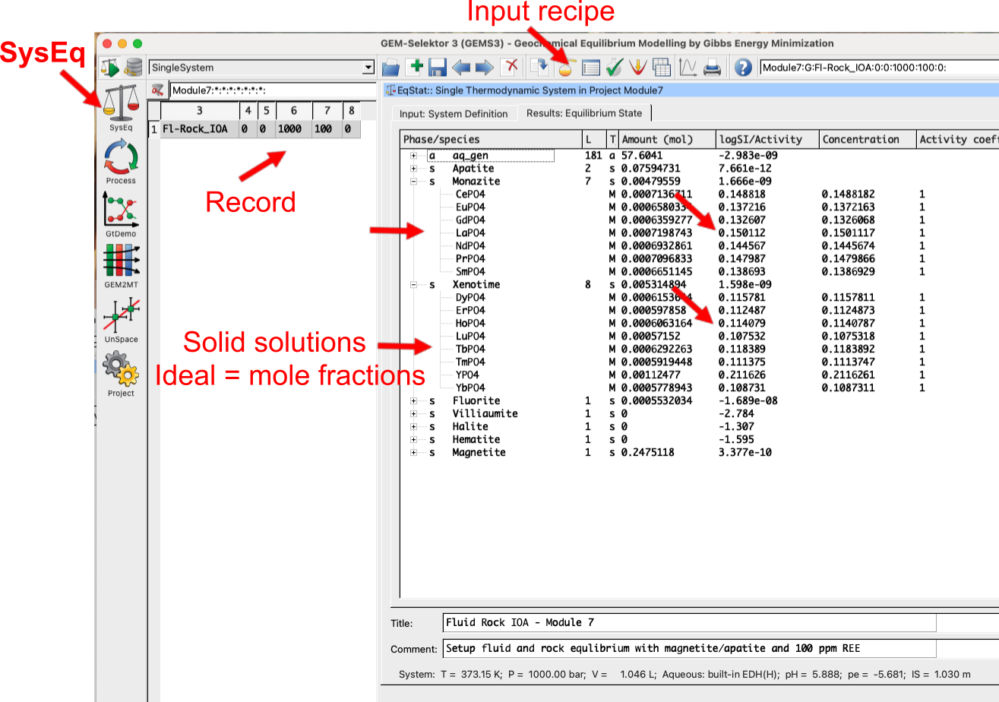
```

## Create our rock and fluid PCO in Thermodynamic database mode
- Switch to `Thermodynamic database mode`, select the `Compos` option and create a new record from scratch (Fig. \@ref(fig:fig-3)). We will call it `Rock_IOA`. 
- Fig. \@ref(fig:fig-4) shows the `PCO` wizard, make sure to select `DComp`, then the elements (`IComp`), then the minerals (magnetite and apatite) that are in the rock.


```{r,fig-3, echo = FALSE, out.width="90%", fig.cap="`Compos` input for adding a new rock or flud record in `Thermodynamic database mode`. This dialog can be reached by clicking on `Compos` module on the left panel."}
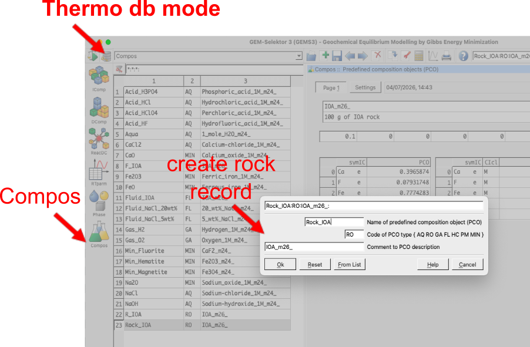
```
```{r,fig-4, echo = FALSE, out.width="90%", fig.cap="`Compos`record wizard. Choose `DComp` if you want to add a dependent component (compound like a mineral) as input recipt; choose `IComp` if you want to add individual elements `IComp` as inputs (this can always be ticked just make sure to enter zeros if you don't want it to be taken into account in your input recipt); choose the number of user defined formula if you want to enter your own formula (e.g. SiO2, HCl, etc.). The next window is self explanatory, just make sure to select `DComp` or `IComp` as needed."}
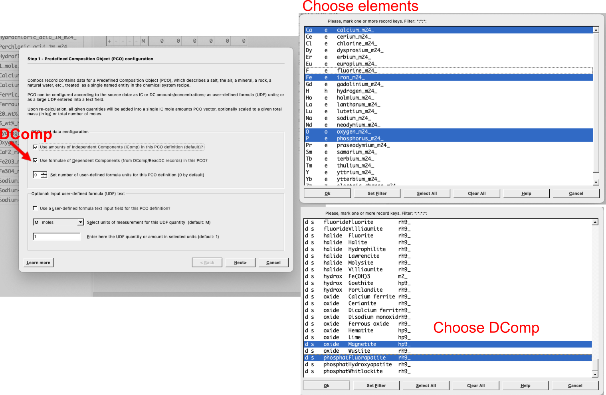
```
- Fig. \@ref(fig:fig-5) shows the resulting `PCO` for the rock and all the steps. In the `Settings` tab you will see either the `DComp` chosen or if selected, the user-defined formula can be entered on the blank lines. Once you have entered units and quantities, move to `Page 1` tab. Here you will make sure that the total rock is normalized to 100g (add 0.1 kg), enter the name and information about the record, switch off/zero the `IComp` values to avoid adding additional elements to the input recipe, then click `re-calculate` to check the total composition. Finally click `Save` to save the record. 

- The same procedure is used to create a `PCO` for the fluid, which we will call `Fluid_IOA`. Select the `Compos` option and create a new `PCO` record from scratch (Fig. \@ref(fig:fig-6)). Make sure to select all of the REE elements as `IComp` and the compounds HCl, NaCl, and H2O from the `DComp` selection window. 

- Fig. \@ref(fig:fig-7) shows the resulting `PCO` for the fluid and all the steps. In the `Settings` tab you will see the `DComp` chosen together with units and quantities. On the `Page 1` tab make sure to enter the REE as `IComp` (100 ppm each), and put a zero in the normalization mass to let GEMS calculate the total mass of fluid, which should appear once you click on `re-calculate`. Finally click `Save` to save the record.
```{r,fig-5, echo = FALSE, out.width="80%", fig.cap="`Compos`record. Start with the Settings tab to input your `DComp` or user-defined formula for your minerals or fluid compounds and add the units (1-2). In the `Page 1` tab follow the sequence: (3) enter record information; (4) enter the normalization mass (i.e., 0.1 kg); (5) make sure the `IComp` values are zero unless additional elements need to be added to the recipe; (6) click the `re-calculate` button to check the total composition shown in window (7)."}
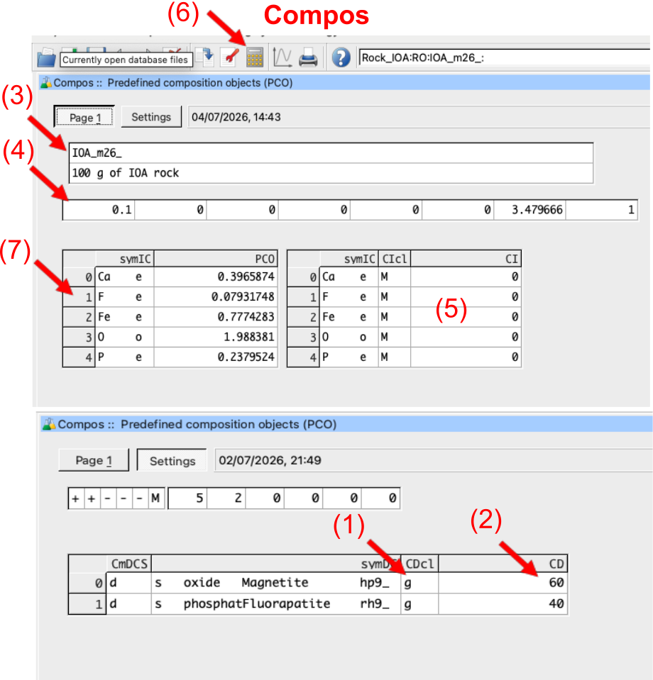
```

```{r,fig-6, echo = FALSE, out.width="90%", fig.cap="`Compos`record wizard used to create the IOA fluid. Make sure to select `DComp` in the first window to see the selected compounds for the fluid (i.e. HCl@, NaCl@, H2O@, O2@). "}
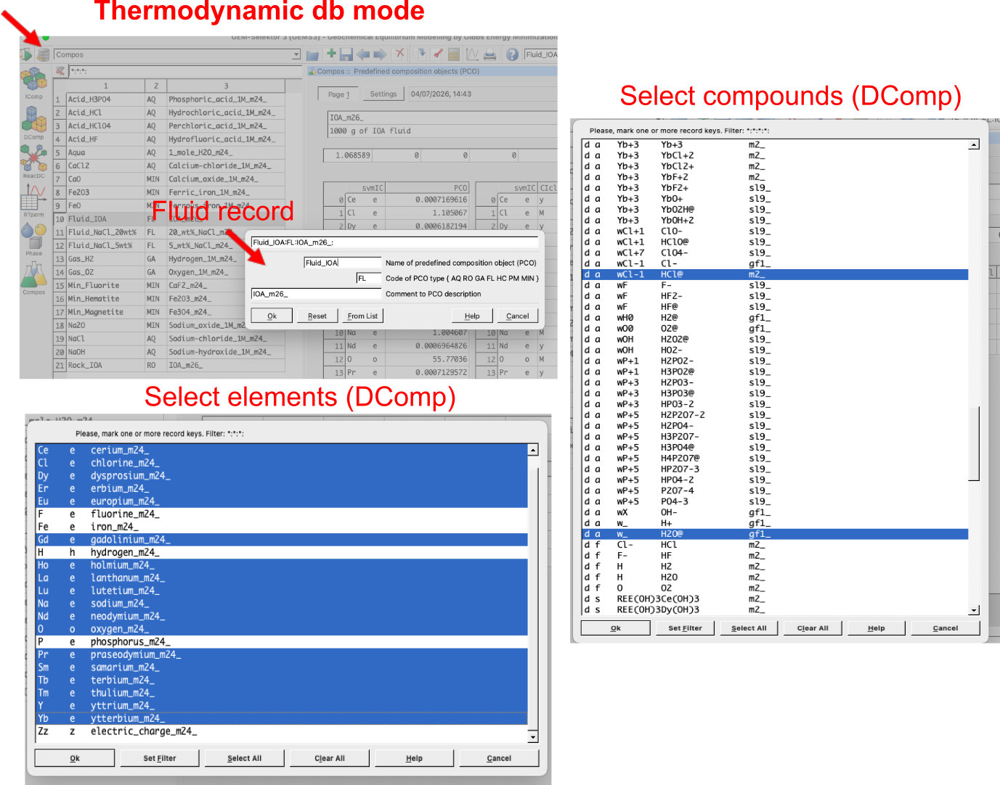
```

```{r,fig-7, echo = FALSE, out.width="60%", fig.cap="`Compos`record showing the selected compounds for the fluid (i.e. HCl@, NaCl@, H2O@, O2@) in the `Settings` tab (1-2), and the `IComp` values in the `Page 1` tab (3-4). Make sure to add 100 ppm for each REE (4), input a zero in step (5), re-calculate in step (6) and inspect the results. "}
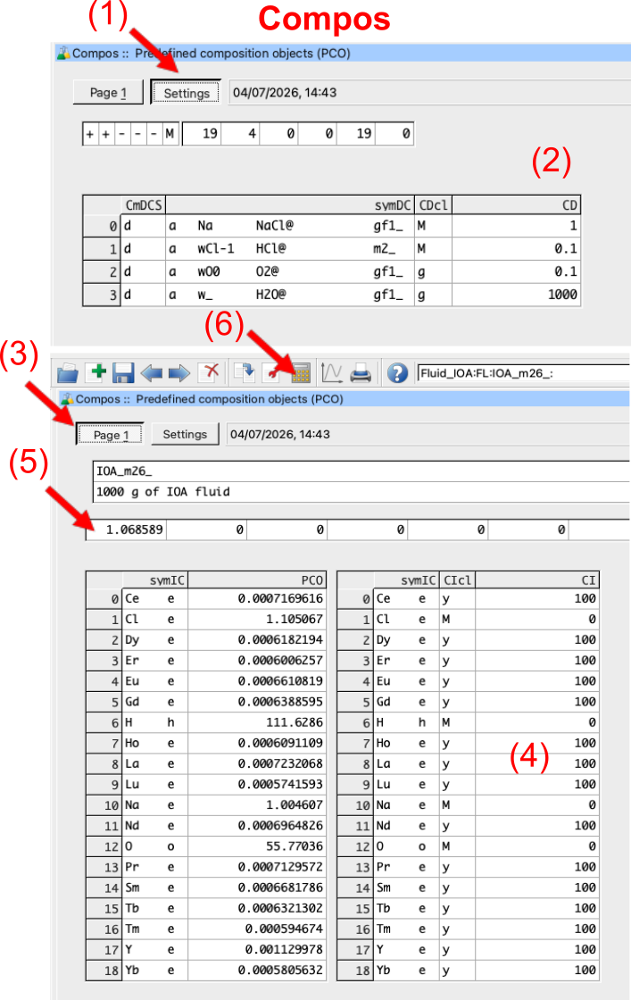
```

## Setting up a multipass leaching model in `Process` simulations
Here we will create a multipass leaching model using a single flow-through reactor in `Process` simulations. But before we start we need to create a parent record in `SysEq` and add the two PCOs we created above to our system. We will make two parent records with 100 g IOA rock and 1000 g of fluid, one record at 100 &deg;C and the other at 350 &deg;C and 1000 bar. 

- Switch back to `System Equilibrium` calculation mode (`SysEq`) to add the two PCOs to our system and create the parent record. You already learned how to do this in the core tutorials, but Fig. \@ref(fig:fig-8) shows what to select. Let's create a record called `FR_multipass` at 100 &deg;C and 1000 bar, and select the two PCOs we created above (i.e. `Rock_IOA` and `Fluid_IOA`) as shown in Fig. \@ref(fig:fig-8). Click ok and calculate equilibrium to check the results. You can clone the record to create another parent system at 350 &deg;C and 1000 bar. 


```{r,fig-8, echo = FALSE, out.width="90%", fig.cap="`Equilibrium Calculation` mode (`SysEq`) showing how to create a parent record in preparation forthe multipass leaching model, and where to enter the rock and fluid PCOs created in the previous step. The resulting record is called `FR_multipass` and is calculated at 100 &deg;C and 1000 bar. Note the initial fluid/rock ratio and amount of fluid given here will be used in the `Process` simulation; for advanced users it can also be changed in the `Process` simulation code later on. Make sure to always add a comment and title for each `SysEq` record created, it will help you to keep track of your records."}
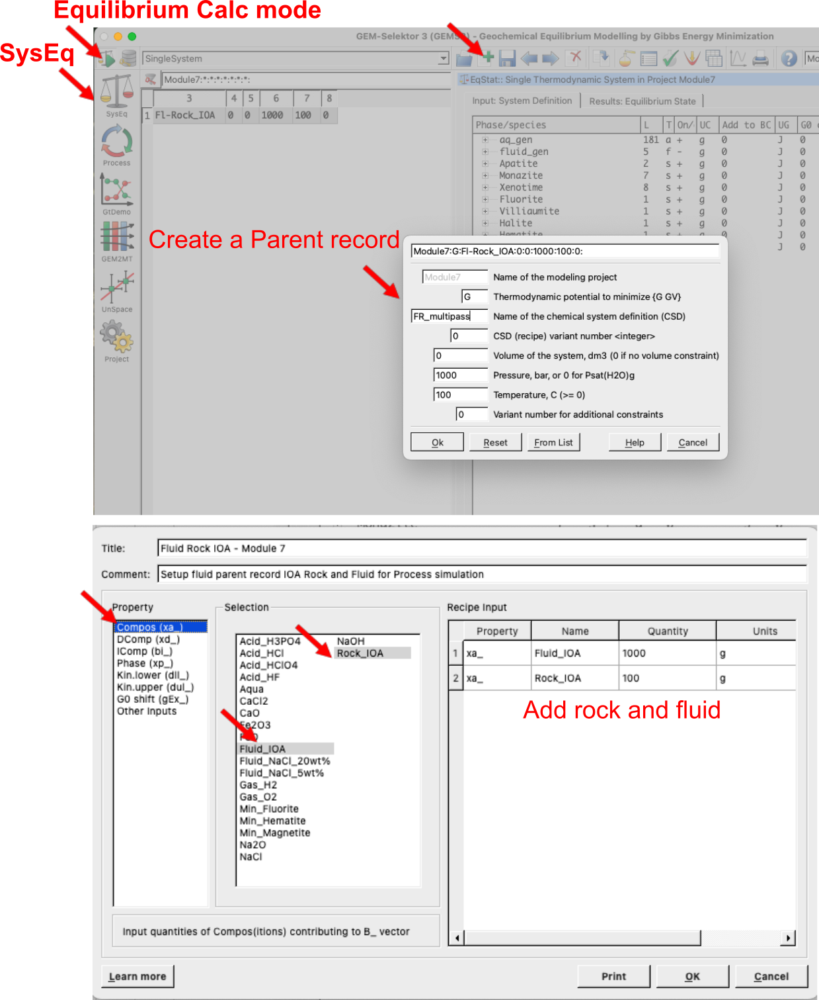
```

- Switch to `Process` simulation mode and create a new record from scratch. We can call it `FR_multipass` and select the  `Process simulation code` (R) for the type of process to simulate as shown in Fig. \@ref(fig:fig-9). In the next wizard step, make sure to select the sequence shown in Fig. \@ref(fig:fig-10). First create the record at 100 &deg;C and 1000 bar. Then repeat the process above to create another `Process` simulation record at 350 &deg;C and 1000 bar. 

- In the plotting window in Fig. \@ref(fig:fig-10) you can select the property to plot on the x- and y-axis. Here we select `phM` for phase mass in grams, and under `Scalars` select `J` which is used for fluid aliquots (right click and select `J` so that it appears as `xp[J]`, i.e. x-axis value). 

- Accept all the following dialogues. Then click on `Save this record to database`, which creates your new process simulation record.

- Under `Process` simulation when you select your record, under the `Controls` tab make sure your setup is correct, including temperature, pressure, 'iTm' (i.e. each record will be assigned a new number, from 1000-1200 in 10 steps means a maximum of 20 records will be generated starting with 1000, 1010, and so forth). In the `Sampling` tab make sure you have xp[J] =: J which represents the x-axis, and a series of variables such as yp[J][0] =: phM[{Apatite}] which represents what to plot on the y-axis.

```{r,fig-9, echo = FALSE, out.width="90%", fig.cap="`Process` simulation mode showing how to create a new record from scratch and select the `Process simulation code` (R) for multipass leaching model. The resulting record is called `FR_multipass_FR10`."}
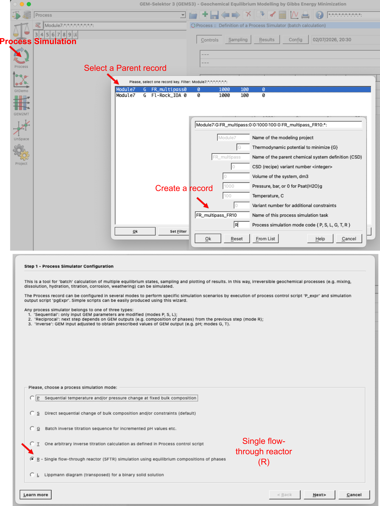
```
```{r,fig-10, echo = FALSE, out.width="90%", fig.cap="`Process` simulation wizard to setup a mutlipass leaching model. (1) Select `Leaching Compos source`, (2) select the fluid, (3) select the rock, (4) enter the P-T conditions or steps if you want to change pressure-temperature. In the `iTm` iterator, one defines the fluid aliquots, for example for record values from 1000 to 1200 in 10 steps results in a total of 20 fluid aliquots (i.e. the first record will be assigned 1000, the second one 1010, etc.). In the plotting window under `Scalars` one finds `J` which is used for flud aliquots; other variables that can be selected there are for example temperature, pH etc. You can select the `Property` in the left panel, here we choose `phM` which is phase mass in grams."}
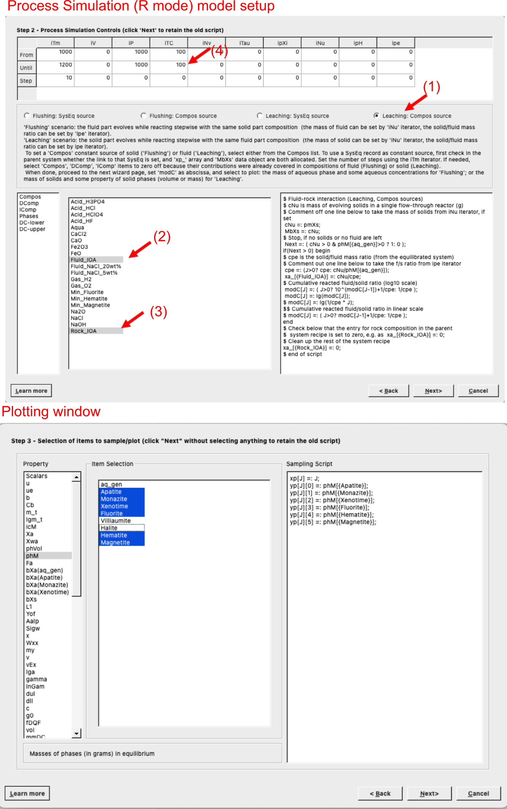
```
## Plotting and model modifications for more acidic fluid
- Click on the calculator icon `Re-calculate and check record data` to display the graph of the process simulation. Figs. \@ref(fig:fig-11)-\@ref(fig:fig-12) show the resulting calculated alteration mineralogy and fluid REE concentrations for the two parent records at 100 &deg;C and 350 &deg;C. Note that the fluid REE concentrations are plotted as a sum of all REE (which can be defined in the `Sampling` tab code), but you can also select individual REE to plot from the wizard.

- To make things interesting go back to the `Thermodynamic database mode` and create a new fluid PCO with more acidic pH (i.e. 1 M HCl instead of 0.1 M HCl) and repeate the steps above. Make a parent record with fluid and rock created in `SysEq`, then in `Process` simulation use these two parent records to do the multipass simulations at 100 &deg;C and 350 &deg;C. Fig. \@ref(fig:fig-11) shows the additional results. 

- Fig. \@ref(fig:fig-12) shows the type of additional plots you can make. In this case we plot log molality of light (L) and heavy (H) REE in the fluid as a function of fluid aliquots. Note that the light REE are more mobile than the heavy REE at high temperature, and that pH plays a crucial role for REE mobilization. Here we use `J` for aliquots of fluid on the x-axis, and `log(m_t[{element}])` for the y-axis, where element is the selected element. You can select individual REE to plot as well, or sum of all light and heavy REE as shown here. For individual elements remake the record and use the wizard. You can modify the plotting script in the `Sampling`tab according to Fig. \@ref(fig:fig-13).

- Here is the plotting code that can be copy pasted:

```py
yp[J][0] =: lg(m_t[{La}]+m_t[{Ce}]+m_t[{Pr}]+m_t[{Nd}]+m_t[{Sm}]+m_t[{Eu}]+m_t[{Gd}]); 
yp[J][1] =: lg(m_t[{Tb}]+m_t[{Dy}]+m_t[{Ho}]+m_t[{Er}]+m_t[{Tm}]+m_t[{Yb}]+m_t[{Lu}]);
```
 
- Can you make such models? If this part became too advanced, I suggest to go back to the core tutorials and repeat the steps above for the Greisen model. Once you are familiar with the `SysEq` and `Process` simulation mode, the plotting scripts, and adding `PCO` records to the thermodynamic databse under `Compos` you can try to make your own models here again. 

```{r,fig-11, echo = FALSE, out.width="100%", fig.cap="Simulated results for single flow-through reactor multipass leaching models at 100 &deg;C and 350 &deg;C, 1 kbar, showing the simulated alteration mineralogy for a fluid with initially 0.1 m HCl (left) and 1 m HCl (right). The models nicely show the replacement reactions between apatite and REE phosphates, and magnetite and hematite. pH plays a crucial role for REE mobilization."}
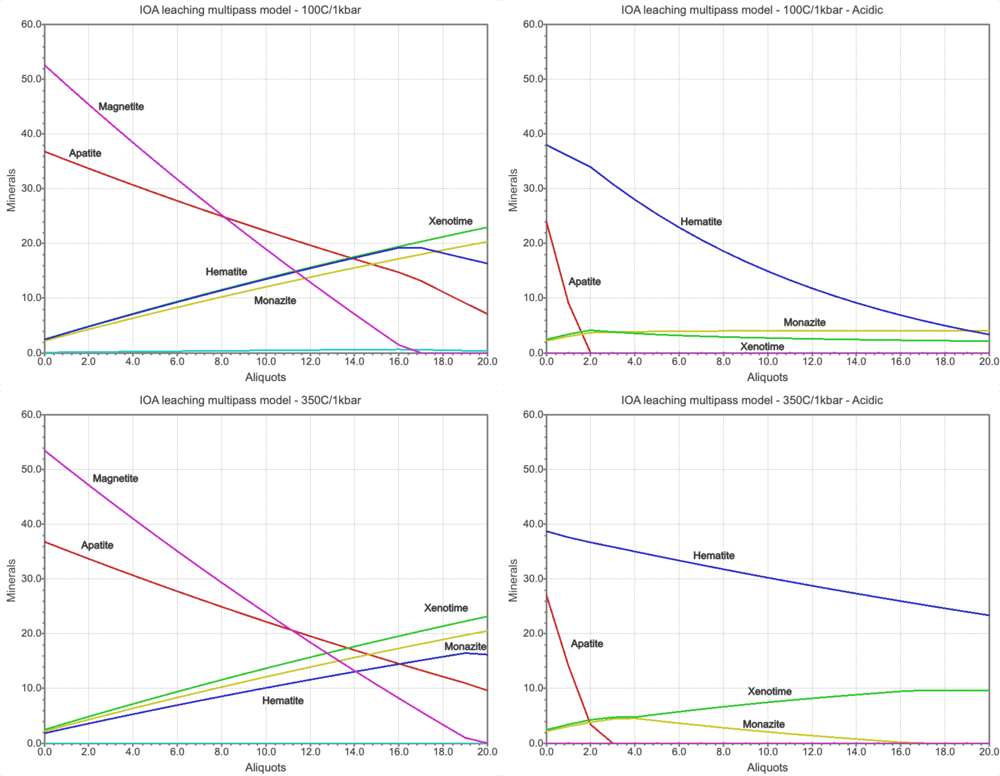
```
```{r,fig-12, echo = FALSE, out.width="75%", fig.cap="Simulated results for single flow-through reactor multipass leaching models at 100 &deg;C and 350 &deg;C, 1 kbar, showing the simulated log molality light (L) and heavy (H) REE for a fluid with 1 m HCl at 100 &deg;C (top) and 350 &deg;C (bottom), 1 kbar. The models nicely show that pH plays a crucial role for REE mobilization."}
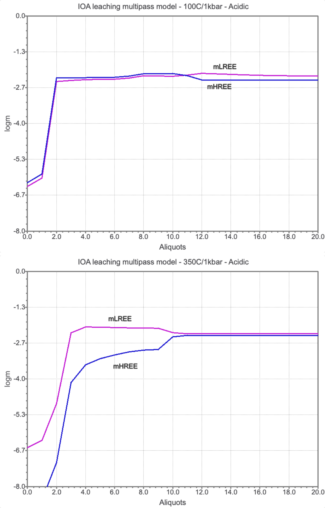
```

```{r,fig-13, echo = FALSE, out.width="90%", fig.cap="`Sampling` tab in `Process` simulation mode showing the plotting script for the log molality of light (L) for `yp[J][0]` and heavy (H) for `yp[J][1]` rare earth elements in the fluid as a function of fluid aliquots `xp[J]`. "}
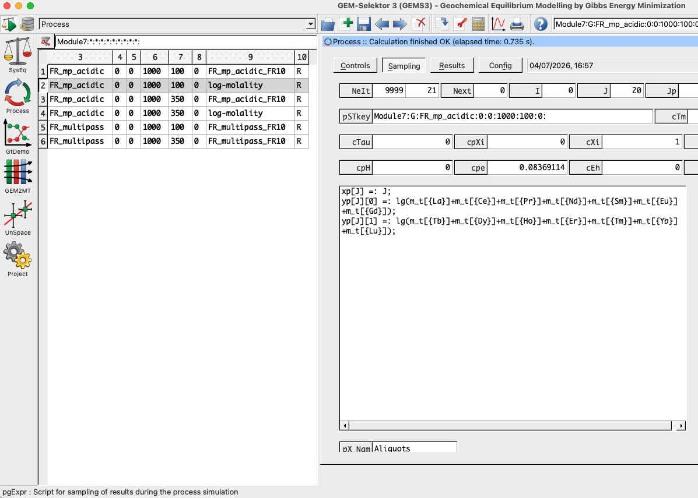
```
## Outcomes
Congratulations, you know now how to make a vein replacement model in GEMS using the MINES thermodynamic database! Couple of things to think about:
- How would the results change if you change the initial fluid composition?
- How would the results change if you change the initial fluid/rock ratio?
- Why are the light and heavy REE fractionated in the modeled fluid, what is the role of pH and temperature?  


