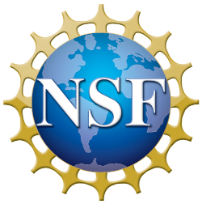
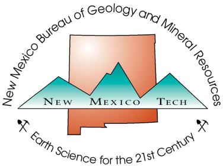

# Acknowledgment {-}

Database development, data compilation for critical elements and student support was possible through the sponsorship by the National Science Foundation and the U.S. Department of Energy. 

- NSF grant EAR-2032761 (1649656) and NSF CAREER EAR-2039674 (1845258) to Alexander Gysi. 
- Office of Science, U.S. Department of Energy, Grant No. DE-SC0021106 to Alexander Gysi.

Support is also provided by the New Mexico Bureau of Geology and Mineral Resources, New Mexico Institute of Mining and Technology.

```{r, echo = FALSE, out.width="25%"}

```

```{r, echo = FALSE, out.width="25%"}

```

```{r, echo = FALSE, out.width="25%"}

```

