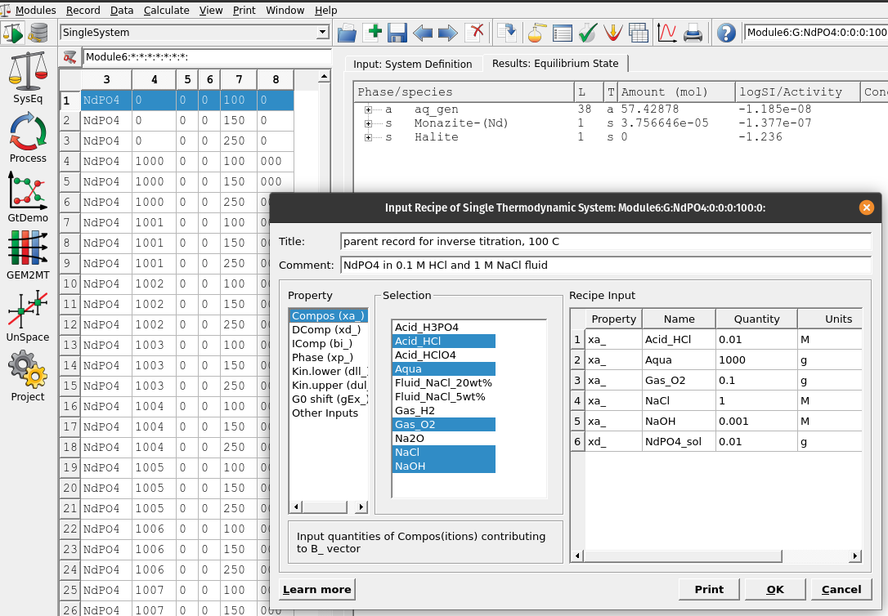
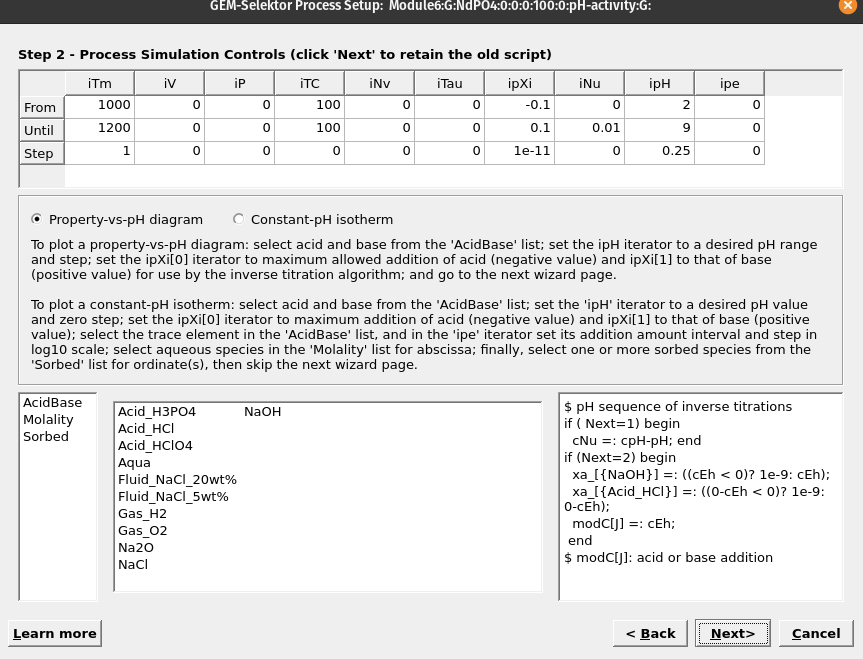
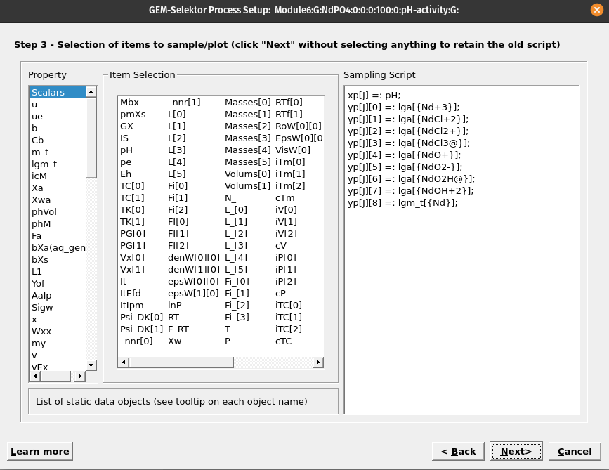

# (PART) Examples & Applications {-}
# pH-activity diagrams: REE aqueous speciation {#module6}

In this chapter we will learn how to build a pH-activity diagram for the speciation of rare earth elements (REE). First we create the parent system in `SysEq` and use the 'G mode' in `Process` simulations to compute an inverse titration model. The latter is an inverse model problem because we give an initial and final pH value and ask GEMS to calculate the amount of acid/base to titrate to the system in order to reach the prescribed pH values and plot our speciation diagram.

The case study involves calculation of the solubility of monazite (NdPO4), and the speciation of Nd chloride and hydroxyl complexes as a function of pH to investigate which species control solubility.

## Create a parent record

The first step is to setup a parent system record in `SysEq`. 

- Select the `SysEq` option in the left panel and create and select 'Create a new record from scratch'.

- We will create a new record NdPO4, using a temperature of 100 $^\circ$C and a pressure of 0 (psat).

- For the input recipe we need to add our acid (HCl) and base (NaOH), which will be adjusted later in the `Process` simulations for the inverse pH titration. Figure \@ref(fig:fig-1f) shows the composition of the system. Make sure to use the unit 'M' for moles acid/base.

(\#fig:fig-1f)Input recipe in 'SysEq' which we need to add our acid (HCl) and base (NaOH) to setup our parent system record to setup an inverse titration problem

## Setting up an acid/base titration

- Now we switch on the left panel and select the `Process` simulation mode and 'Create a new record from scratch'. We can call it pH-activity and select the  `Process simulation code` (G) for the type of process to simulate as shown in Figures \@ref(fig:fig-2f).

- In the next window, first choose a model (`Property-vs-pH diagram`), and in sequence select first the acid (HCl) then the base (NaOH), which should replace the code in the right window. Make sure to select a temperature (e.g. 100 $^\circ$C) and pressure (0 for psat). 

- In the column with 'ipXi' we select the maximum amount of acid (i.e. 'ipXi[0]' -0.1 corresponds to 0.1 mol HCl) and based (i.e. 'ipXi[1]' 0.1 corresponds to 0.1 mol NaOH). 'ipXi[2]' indicate the minimum amount of titrant (usually 1e-10 to 1e-11 mol). The cell 'iNu[1]' indicates the required precision for the inverse titration (i.e., 0.01 pH unit). Finally the fields for 'ipH' indicate in sequence the starting and final pH, and pH steps required for the calucations. In our example we chose pH from 2 to 9 in 0.25 steps. Figures \@ref(fig:fig-3f) shows the overall setup. Once everything is setup click next.

- Select items to be plotted (`Scalars`: pH;  `lga`: aqueous Nd species; 'lgm_t' dissolved Nd, as shown in Figure \@ref(fig:fig-4f).

- Accept all the following dialogues. Then click on `Save this record to database`, which creates your new process simulation record.

- In the "Controls" tab make sure your setup is correct, including temperature, pressure, amounts of titrants, pH ranges and steps, and have enough records under 'iTm' (i.e. each record will be assigned a new number, from 1000-1200 in 1 steps means a maximum of 200 records will be generated starting with 1000, 1001, and so forth). Not that error messages during the calculations commonly stem from to little amounts added for maximum acid/bases in the 'ipXi' field. If that is the case you can try to increase the mole amounts from 0.1 to 1 mol. The amount of acid/based required to reach a certain pH depends on the initial fluid composition, minerals used, temperature etc.

Congratulations, you know now how to make a REE speciation diagram in GEMS using the MINES thermodynamic database!

- Then click on the calculator icon `Re-calculate and check record data` to display the graph. Figure  \@ref(fig:fig-5f) shows the resulting pH-activity diagram for Nd speciation.

(\#fig:fig-2f)In `Process` we create a new record from scratch and select the `Process simulation code` (G) for inverse titration.

(\#fig:fig-3f)In this wizard step we select the properties of the model.

(\#fig:fig-4f)In this wizard step we select the variables to be plotted. pH is found under 'Scalars', log activity of Nd species und 'lga' and total dissolved log molality Nd under 'lgm'. Note to select pH for the x-axis, right click on it first, then select 'Abscissa', then select the variables to plot on the y-axis.

(\#fig:fig-5f)pH-acitivty plot showing the total dissolved molality of Nd as a function of pH and the log activity of acqueous Nd species. In this example Nd3+ and Nd chloride species are predominant at acidic pH and Nd hydroxyl species at higher pH. Note that the Nd hydroxyl species originate from the Supcrt92 database, and need to be updated in the future. The species are represented as anhydrous compounds but can be related to the more common stoichiometric formula, for e.g. NdO2H0 + H2O = Nd(OH)30.

