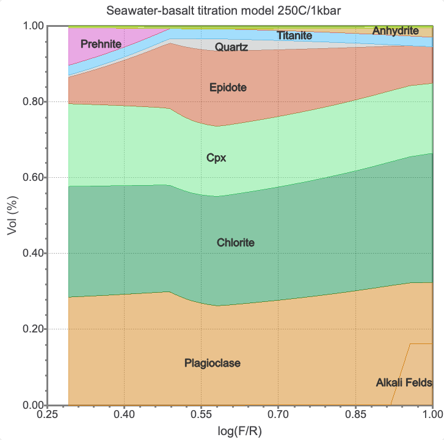
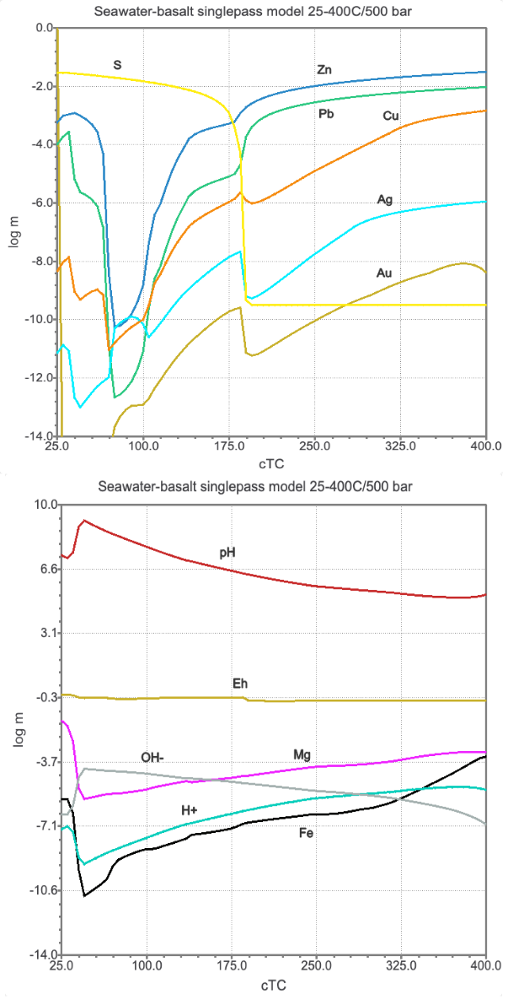

# Seawater-basalt recharge zone at Volcanogenic Massive Sulfide (VMS) Deposits {#module8}

Volcanogenic Massive Sulfide (VMS) deposits occur as ancient seafloor ore bodies rich sulfides containing copper, zinc, lead, gold, and silver. These deposits are thought to have formed close to hydrothermal vents, which are found at mid-ocean ridge and back arc basins. The hydrothermal fluids are thought to be derived from oxidized sulfate ($\text{SO}_4^{2-}$) seawater that has circulated through the oceanic crust and reacted with the basaltic rocks with the sulfur reduced to sulfides. 

Base and precious metals are leached from the basaltic rocks and precipitated as sulfides in the seafloor. There are several zones that can be distinguished in the formation of VMS deposits, including the seawater recharge zone, the hydrothermal fluid flow zone, and the seafloor deposition zone. 

In this module, we will focus on the seawater recharge zone and model the interaction of seawater with basalt at elevated temperatures and pressures, simulating the conditions found in the subsurface near hydrothermal vents. The model we will setup includes a titration model to study the porosity evolution with reaction progress. The model will also include the formation of secondary minerals, such as smectites and chlorite, which can affect the porosity and permeability of the rock. Then we will setup a single pass cooling model to study the mobility of base and precious metals including Cu, Pb, Zn, Ag, and Au. The model will also include the formation of sulfide minerals, such as pyrite, galena, sphalerite, and chalcopyrite, which can affect the metal mobility and deposition near the seafloor.


<div class="figure">

<p class="caption">(\#fig:fig-1)Schematic of a VMS deposit showing the seawater recharge zone, the hydrothermal fluid flow zone, and the seafloor deposition zone. The seawater recharge zone is where seawater infiltrates the oceanic crust and reacts with basaltic rocks, leading to the formation of hydrothermal fluids that eventually precipitate metals as sulfides on the seafloor. Modified from Hurtig, N. C., Gysi, A. P., Monecke, T., Petersen, S., & Hannington, M. D. (2024). Tellurium transport and enrichment in volcanogenic massive sulfide deposits: Numerical simulations of vent fluids and comparison to modern sea-floor sulfides. Economic Geology, 119(4), 829-851. </p>
</div>
## Calculate the seawater-basalt equilibrium at elevated temperatures and pressures
The seawater and basalt compositions are taken from the MINES database, and can be inspected in the `Thermodynamic database` mode. The seawater composition is based on the standard seawater composition, and the basalt composition is based on a typical mid-ocean ridge basalt (MORB) composition. The major problem with these models is the kinetics and possibly the thermodynamic properties for some of the minerals and/or aqueous species that need to be updated. Typically, this results in some minerals that should form at high temperature that stabilize in the model at temperatures much lower than these occur in natural systems. Here we will learn how to add a metastability constrain to deal with these phases, and allow metastable phases to form instead of the thermodynamically stable phases. A typicall example would be modeling of chalcedony/quartz and smectites/chlorite stability.

- The first step is to prepare a record in `SysEq` to calculate the equilibrium between seawater and basalt at elevated temperatures and pressures. Create a new record in `SysEq`, call it `SW-B` and select the seawater and basalt compositions from the MINES database. Set the temperature to 250 $^{\circ}$C and the pressure to 1 kbar, which are typical conditions found in the subsurface near hydrothermal vents. For the input recipe use 1000 g seawater and 50 g basalt; to spice things up we will add 0.1 ppm Ag and Au, 100 ppm Cu and 1000 ppm Zn and Pb to the system composition. The record is shown in Fig. \@ref(fig:fig-2). We then calculate the equilibrium and inspect the results. 


<div class="figure">

<p class="caption">(\#fig:fig-2)`SysEq` window showing how to create a new parent record. Select basalt and seawater from the MINES thermodynamic database, listed under `Compos`, and select base and precious metals under `IComp` and add the respective concentrations.</p>
</div>

- The results show that the seawater-basalt reaction is dominated by the formation of secondary minerals, such as phyllosilicates (chlorite, smectites), epidote, anhydrite, and the metals precipitate into sulfides such as sphalerite, galena, chalcocite. Now we can try to add a metastability contrain to avoid forming smectites at this temperature. We open the `Recipe dialog` (yellow vial) and select `Kin.upper (dul_), since the smectites are solid solutions we need to select all saponite endmembers and add 0 M. See Fig. \@ref(fig:fig-3) for more details. Then re-calculate equilibrium to check what happens when smectites are "switched off".

<div class="figure">

<p class="caption">(\#fig:fig-3)`SysEq` window showing the modeling results for basalt alteration minerals (top) and the input recipe window (yellow vial) to add kinetic metastability constrain `Kin.upper(dul_)` for saponite (bottom).</p>
</div>

## Clone and create a basalt PCO with metals (Cu, Pb, Zn, Ag, and Au)
The seawater and basalt compositions are taken from the MINES database, and can be inspected in the `Thermodynamic database` mode. We will now add base and precious metals to the basalt composition. 

- Switch to `Thermodynamic database` mode, and under `Compos` select R_Basalt and `Clone` this record and call it "R_Basalt_metals". Make sure to select Cu, Pb, Zn, Ag, and Au in the next window (Fig. \@ref(fig:fig-4)).

- Add 0.1 ppm Ag and Au, 100 ppm Cu and 1000 ppm Zn and Pb. In the normalization amount field you can add a zero, then re-calculate, it should then generate the outputs shown in Fig. \@ref(fig:fig-4). Note if you go in the `Settings` tab you can inspect the basalt composition, under `Page 1` tab you see the base and precious metals entered as independent components (`IComp`).

<div class="figure">

<p class="caption">(\#fig:fig-4) Setup of a PCO in `Compos` in `thermodynamic database mode` showing how to create/clone the basaltic rock and add base and precious metals to its input comosition. Make sure to select the independent components (`IComp`) as shown in the top window, and add the amounts and units in the first tab on `Page 1`. Choose 0.1 ppm Au and Ag, 100 ppm Cu, and 1000 ppm Pb and Zn.</p>
</div>

## Seawater-basalt titration model and porosity evolution
Before we dive into any open system modeling, let's have a look at a titration model. The goal is to titrate 50 to 500 g of basalt in 10 g steps to 1000 g of seawater and inspect the evolving alteration mineralogy. We will create a custom script to track volume percent minerals (vol%) as a function to fluid/rock ratios (F/R). High F/R ratios represent the core of the upflow/recharge zone where the fluid completely dominates and leaches the rock. Low F/R ratios (high basalt mass) represent the fresh rock matrix far from the conduit.

- To begin we create a parent record in `SysEq` with the basalt and seawater, then we move on to the `Process simulation` mode (left panel of GEMS) and create a new record. Make sure to select the parent record you just created, call it "SW-B_titr" and select the titration model, which is called `S mode` (Fig. \@ref(fig:fig-5)).


<div class="figure">

<p class="caption">(\#fig:fig-5)Top shows the parent record created in `SysEq` with seawater and basalt added. The bottom window shows the selection of this parent record when creating a new record in the `Process simulation` mode for the titration model (`S mode`).</p>
</div>
- The next window show the tiration model setup (Fig. \@ref(fig:fig-6)), make sure to enter these numbers and select the correct model. The number 1 problem I encounter is when someone forgets to add a reasonable pressure in the pressure cell. Click next and select the variables to plot (Fig. \@ref(fig:fig-6)). For now we choose cNu which is g rocks titrated, and phVol which is volume of each mineral in cm3. 

- Click your way through the wizard until step 4 and make sure to tick `Volume V, I ('vV')` for allocating an optional data vectors (Fig. \@ref(fig:fig-6)). What this does, it frees up a variable in which we will save the sum or total volume of each of our minerals. Click next. Make sure to save this record.

<div class="figure">

<p class="caption">(\#fig:fig-6)(Step 2) Titration model setup in `S mode` in the `Process simulation` mode. Make sure to (1) select the correct model, (2) select the titrant, here we use basalt, (3) select the initial, final and steps of basalt to be added, (4) add the correct pressure and temperature (here we use a constant P-T, but steps and gradients can be scripted). (Step 3) Variables to be selected for plotting, here we choose first `Scalars`, right click and choose abscissa for cNu which is grams rock added, then switch to `phVol` to select phase volumes in cm3. (step 4) Tick `Volume V, I ('vV')` for allocating an optional data vectors </p>
</div>


- The next step is to click on the calculator to test our calculation. Check the `Results` tab and you can plot the results which should display volume minerals as a function of mass of basalt added.

- Now let's take it a step further, and create a custom script (copy paste them from below). If you want you can clone the record you made earlier and rename it to test the custom script. I made this one for you, try it out. Copy paste the scripts below; one is for the the `Controls` window/tab, here we want to create a variable called `ipe` which captures the logarithm of fluid/rock ratio (F/R). We move then to the `Sampling` tab to update our x-axis to plot the F/R ratio and y-axis to plot mineral volume %. Fig. \@ref(fig:fig-7) shows how your script window should look like.

- Script for `Controls` window:
```py
$titration model
xa_[{R_Basalt_metals}] =: cNu * 1;

$(custom script) calculate Log10 Fluid/Rock mass ratio using iterator ipe 
ipe =: lg( phM[{aq_gen}] / cNu );

$(custom script) metastability constraints smectites
dul_[{Ca-Saponite}]=: ( cTC >= 200? 0 : 1);
dul_[{Fe-Saponite}]=: ( cTC >= 200? 0 : 1);
dul_[{K-Saponite}]=: ( cTC >= 200? 0 : 1);
dul_[{Na-Saponite}]=: ( cTC >= 200? 0 : 1);

```

- Script for `Sampling` window:
```py
xp[J] =: ipe;
$(custom script) make variable to calc total volume
cV[J] =:  phVol[{Alkali Feldspar}] + phVol[{Plagioclase}] + phVol[{Chlorite}] + phVol[{Cpx}] + phVol[{Epidote}] + phVol[{Quartz}] + phVol[{Titanite}] + phVol[{Hematite}] + phVol[{Magnetite}] + phVol[{Prehnite}] + phVol[{Anhydrite}] + phVol[{Gold}] + phVol[{Silver}] + phVol[{Acanthite}] + phVol[{Bornite}] + phVol[{Chalcocite}] + phVol[{Chalcopyrite}] + phVol[{Covellite}] + phVol[{Galena}] + phVol[{Pyrite}] + phVol[{Sphalerite}];
yp[J][0] =: phVol[{Alkali Feldspar}] / cV;
yp[J][1] =: phVol[{Plagioclase}] / cV;
yp[J][2] =: phVol[{Chlorite}] / cV;
yp[J][3] =: phVol[{Cpx}] / cV;
yp[J][4] =: phVol[{Epidote}] / cV;
yp[J][5] =: phVol[{Quartz}] / cV;
yp[J][6] =: phVol[{Titanite}] / cV;
yp[J][7] =: phVol[{Hematite}] / cV;
yp[J][8] =: phVol[{Magnetite}] / cV;
yp[J][9] =: phVol[{Prehnite}] / cV;
yp[J][10] =: phVol[{Anhydrite}] / cV;
yp[J][11] =: phVol[{Gold}] / cV;
yp[J][12] =: phVol[{Silver}] / cV;
yp[J][13] =: phVol[{Acanthite}] / cV;
yp[J][14] =: phVol[{Bornite}] / cV;
yp[J][15] =: phVol[{Chalcocite}] / cV;
yp[J][16] =: phVol[{Chalcopyrite}] / cV;
yp[J][17] =: phVol[{Covellite}] / cV;
yp[J][18] =: phVol[{Galena}] / cV;
yp[J][19] =: phVol[{Pyrite}] / cV;
yp[J][20] =: phVol[{Sphalerite}] / cV;
```
<div class="figure">

<p class="caption">(\#fig:fig-7)`Process simulation mode` with `Controls` window used for the titration script setup and the `Sampling` script to plot up variables. Here we use a custom script which can be copy-pasted from the text into your script windows.</p>
</div>
- Finally run the script by clicking re-calculate, and inspect the results. You should be getting something similar to Fig. \@ref(fig:fig-8). The plot can be modified in the plot window including x-/y-axes labels, plot title, etc. 


<div class="figure">

<p class="caption">(\#fig:fig-8)Seawater-basalt interaction simulation results showing the volume % of minerals as a function of logarithm of the fluid/rock ratios (F/R).</p>
</div>

## Singlepass heating model - mobilization of Cu, Pb, Zn, Ag, and Au
 Instead of adding rock to a single beaker, we are now taking a fixed packet of fluid ($1000\text{ g}$ of seawater) and passing it sequentially through a series of connected rock blocks (reactors) along a progressive temperature gradient. In this model we will simulate the recharge zone where cold seawater reacts with a series of boxes with fresh basalts. This open system model investigates at which temperature we find the optimal metal mobility, and is also useful to build an input fluid model for later modeling the fluid conduit and uplow zone towards the hydrothermal vents. Typically, the highest temperatures reached at depth close to the impermeable zone and magma body is about 400 $^{\circ}$C.

- In `SysEq` create a parent record with seawater and basalt containing the metals by cloning the record you created for the tiration model. Call it "SW-B_singlep" and calculate equilibrium at 25 $^{\circ}$C and 500 bar. We will use 1000 g of seawater and 5 g of basalt. Calculate equilibrium, note that different mineral phases are now stable, some make sense at low temprature such as celadonite, others might be related to the need to add metastability constraints or update the thermodynamic data, which might be more adequate at higher temperature. 

- Switch to the `Process simulation` mode and create a new record from scratch. Make sure to select the parent record you just created. Call the record "SW-B_singlepass" and choose the `R mode` this time for single flow-through reactor. Fig. \@ref(fig:fig-9) shows the setup for the flushing model and plotting window. For the x-axis (abscissa, right click in scalar) we choose `cTC` and for the y-axis we choose `lgm_t` which is logarithm molality of total dissolved elements. Click next to get out of the wizard, save, and calculate your results. 

<div class="figure">

<p class="caption">(\#fig:fig-9) (Step 2) Setup of singlepass flushing and heating model (`R mode`): (1) select flushing, (2) select the basalt, (3) seawater, (4) a temperature increase from 25 to 400 &deg;C at 500 bar. (Step 3) Select the log molality elements to be plotted under `logm_t`; use temperature for the x-axis under `Scalar`.</p>
</div>

- Your plot should look like Fig. \@ref(fig:fig-10). If you want you can make additional plots by cloning this record, and for example select pH, Eh, or other variables to plot. 

- In Fig. \@ref(fig:fig-10) we can see two competing processing for metal mobility. On one hand we have sulfate that gets reduced through interaction of seawater with basalt and results in the precipitation of sulfides in the low temperature range of the model (25-50 &deg;C). This is reflected by the dip in concentration, which is followed by an increase in metal mobility due to an increase in solubility of these metals with prograde temperatures. The reason for this lies in the speciation and a fundamental understanding of metal-ligand complexes, which can be further inspected in the model. To do so I invite you to try to model different fluid parameters to get a better understanding of what controls metal mobility in VMS systems.

- A major problem of this model is that sulfur is entirely consumed around 175 &deg;C (Fig. \@ref(fig:fig-10)), however, we want to see how soluble the sulfides are. The model assumes that the metals are part of the basaltic glass when we added them to the `PCO` and created the metal-bearing basalt. There are several possible reasons why this might not be realistic. Details aside, the flushing model only represents a single pass through the basalt, but once an alteration zones develops, S might be able to be mobilized further into the high temperature region. To model a series of sequential reactors with multiple fluid passes you can try the [GEM2MT Module 5](#module5).

<div class="figure">

<p class="caption">(\#fig:fig-10)Singlepass flushing and heating model showing the logarithm molality of total dissolved elements in the reacted seawater, pH, eH and activities of OH^-^ and H^+^. This model was setup with 5 g of basalt in each box, 1000 g of reactive seawater and a temperature increase from 25 to 400 &deg;C at 500 bar.</p>
</div>
## Outcomes
Congratulations, you now know how to make a rock with metals, setup a custom script to plot volume %/porosity evolution, and setup a single pass heating model to inspect metal mobility in VMS systems! Couple of things to think about:

- How would the results change if you change the initial basalt compositions, maybe add 1500 ppm S?
- How would the results change if you change the initial seawater/basalt ratio?
- Why are Pb and Zn so mobile? what complexes control transport of Cu? What minerals control solubility of Cu, Pb, and Zn?
- What is the role of pH for metal mobility? and what controls pH in VMS deposits?

**Couple of hints**:

**The Magnesium-Clearing Engine**: The bulk pH of the fluid is fundamentally driven by a massive chemical exchange between seawater and the rock matrix. Pristine seawater contains a huge reservoir of dissolved Mg^2+^. As it heats up, it aggressively pulls silica and iron from the dissolving basalt to form hydrous secondary sheet silicates.

**The Structural OH^−^ Consumer**: Chlorite (and at lower temperatures, Mg-smectites like saponite) is the primary mineral that controls and locks away OH^−^ groups. This occurs between 200 and 300 &deg;C. 

4SiO~2~​ (aq)+5Mg^2+^+Fe^2+^+10H~2~​O→Mg~5~​FeSi~4~​O~10~​(OH)~8~​ (Chlorite)+12H^+^

**The Proton Surplus**: To supply the hydroxyl (OH^−^) groups required to precipitate chlorite, neutral water molecules (H~2~​O) are forced to dissociate. The mineral consumes the OH^−^, pumping a massive surplus of free protons (H+) straight into the fluid, crashing the pH.

The Acidification Curve: As temperature climbs from 25 to 350 &deg;C, fluid pH drops drastically from a slightly alkaline ~8-9 down to an acidic 2-4. 

Once Reaction A generates acidity (H+) at high temperatures (>350 &deg;C), the fluid switches from a hydration agent to a leaching agent. It uses that acid to strip trace metals out of the primary basalt matrix, turning into an ore-forming fluid:

CuFeS~2~​ (Chalcopyrite in basalt)+2H^+^+2Cl^−^→CuCl^2−​^ (aq)+Fe^2+^ (aq)+2H~2~​S (aq)

Lots to think about...
