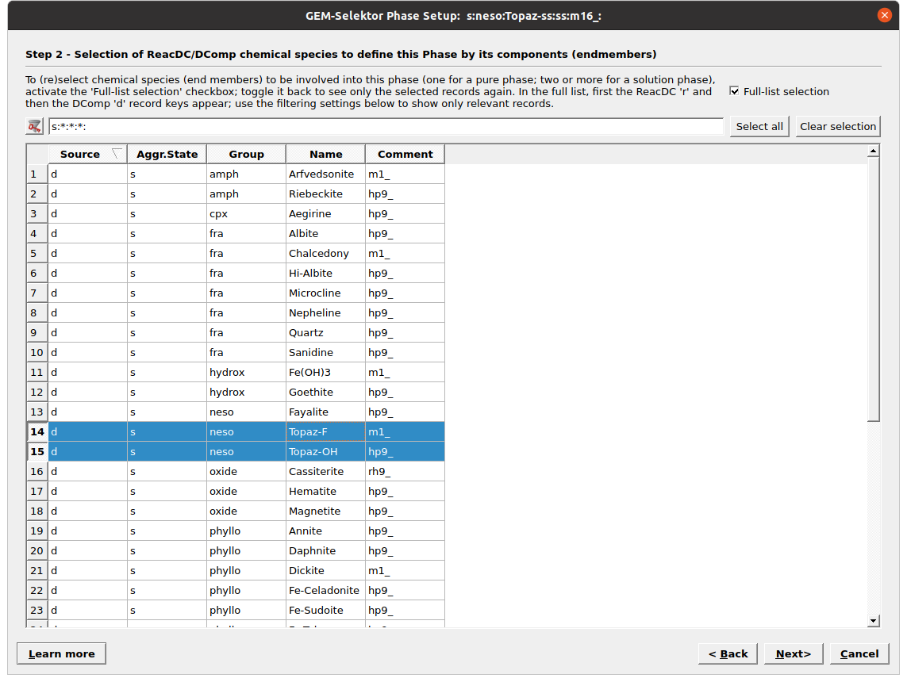
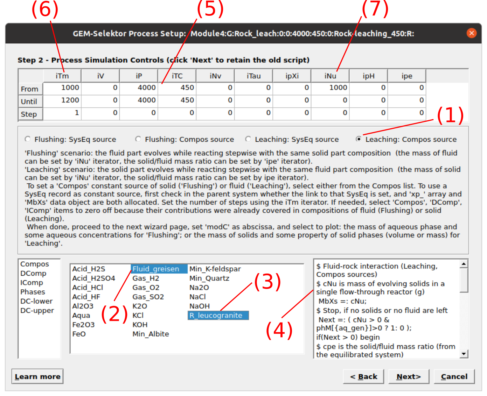
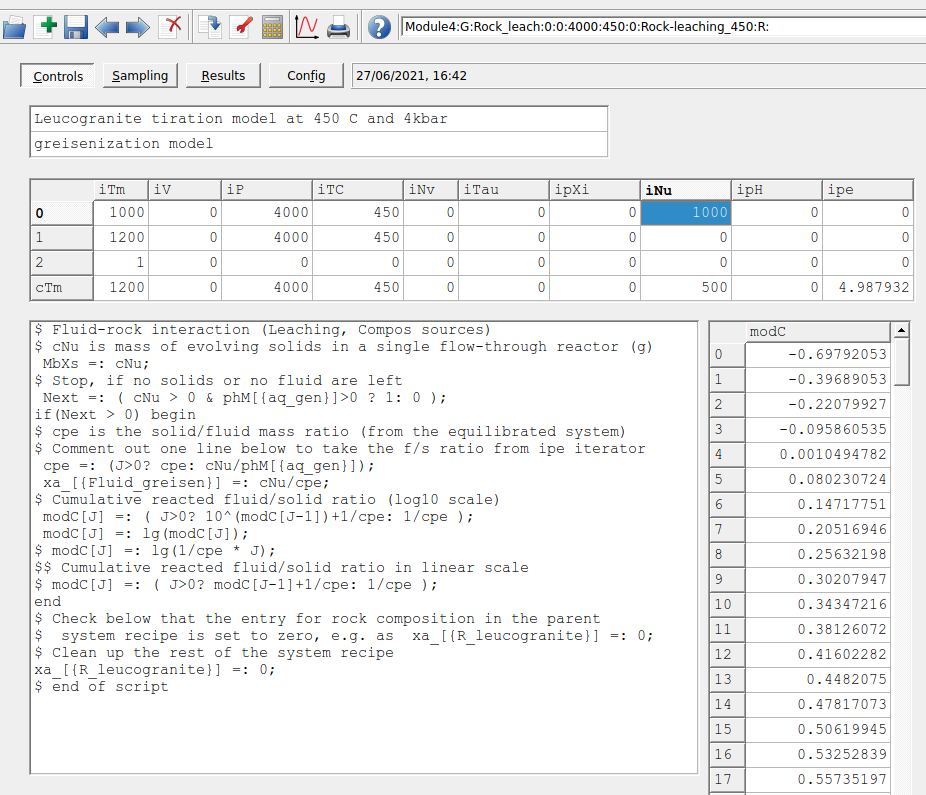
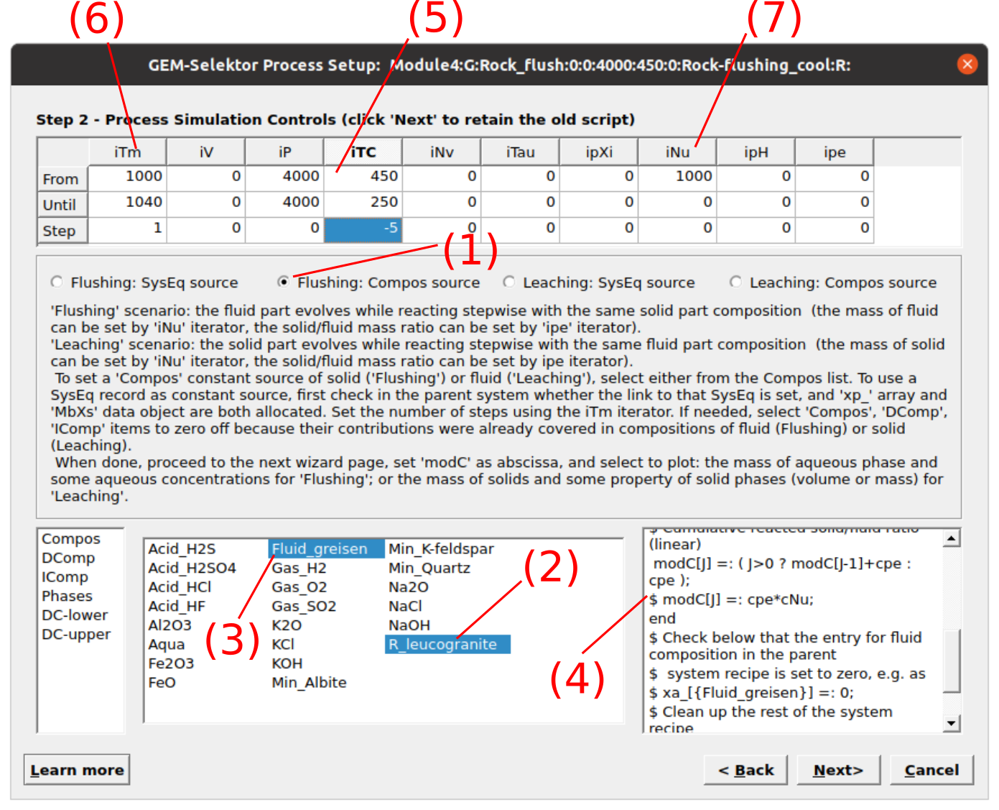
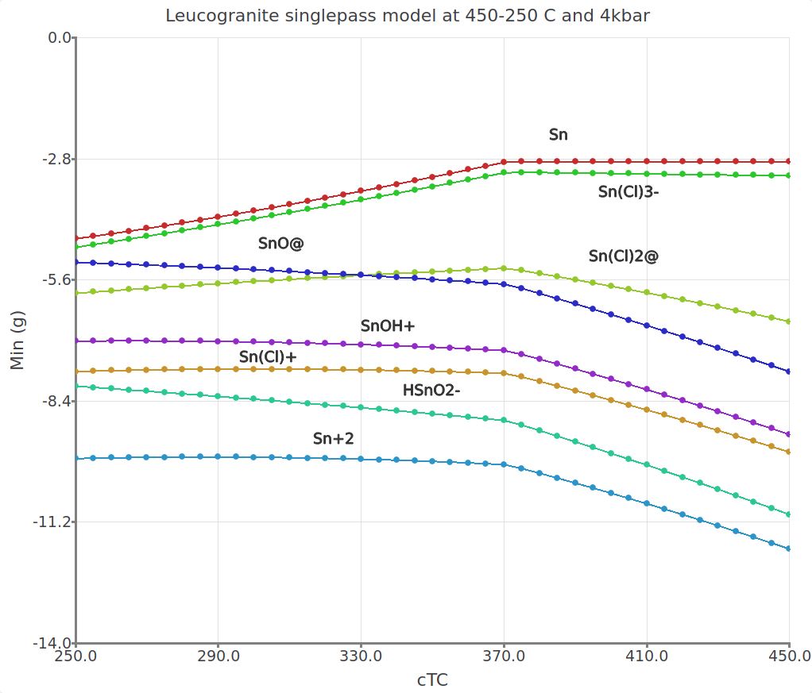

--- 
title: "A tutorial for geochemical modeling of fluid-rock interaction using GEM-Selektor and the MINES thermodynamic database"
author: "Alexander Gysi"
date: "`r Sys.Date()`"
site: bookdown::bookdown_site
output: bookdown::gitbook
documentclass: book
bibliography: [book.bib, packages.bib]
biblio-style: apalike
link-citations: yes


---

# Prerequisites {-#prerequisites}

 GEM-Selektor (GEMS), is a numerical modeling program with a graphical user interface based on Gibbs energy minimization and permits calculating and solving fluid-rock interaction problems of interest in geochemistry. 
 
- Installation instructions for GEMS and more information about this modeling program can be found on the GEMS team webpage: http://gems.web.psi.ch/GEMS3/techinfo.html. 

- Information about the MINES database and project files for the tutorials can be found under https://geoinfo.nmt.edu/mines-tdb


<!--chapter:end:index.Rmd-->

# Create your first project in GEMS {#intro}

 Here we will learn how to create a new Project, the selection of thermodynamic databases, components and equations of state for your modeling project. We will also explain the project folder structure and how to install the [MINES thermodynamic database](https://geoinfo.nmt.edu/mines-tdb) for modeling hydrothermal fluid-rock interaction and ore-forming processes . You will also learn how to interact basalt with water in your first equilibrium calculations.
 
## Installing the MINES thermodynamic database

The MINES thermodynamic database can be downloaded at https://geoinfo.nmt.edu/mines-tdb (Fig. \@ref(fig:fig-1)).


```{r,fig-1, echo = FALSE, out.width="90%", fig.cap="The MINES thermodynamic database webpage and files to download. Select the weblink for MINES19."} 
knitr::include_graphics("figures/module1/fig-1.png")
```


- Download and unzip the DB19.default archive folder to Downloads. Select all the database files in this folder and copy them (Fig. \@ref(fig:fig-2)).

- Merge these database files with the Gems3-app/Resources/DB.default folder by pasting them into DB.default (Fig. \@ref(fig:fig-3)). 
 	
_In Linux this folder is in /Gems3-app/Resources/DB.default; In Mac OSX this folder is in /Applications/gems3 then right-click show package content and go to Contents/Resources/DB.default; In Windows this folder should be in /Gems3-app/Resources/DB.default._
 	
The folder structure of the GEMS program, independent of the operating system used, consists of two main folders: 

 		
- Gems3-app
    + The GEMS3-app folder contains the program resources and also a subfolder Resources/ DB.default, which will be used to copy the MINES thermodynamic database files into it. 

- Library/Gems3/projects
    + The projects folder will contain all the projects you create and work on, and will also be the folder in which you can copy the tutorial folders. 
 	
 ```{r,fig-2, echo = FALSE, out.width="70%", fig.cap="Unzipped DB19.default folder and database files to copy."} 
knitr::include_graphics("figures/module1/fig-2.png")
```

```{r,fig-3, echo = FALSE, out.width="70%", fig.cap="Database files merged with the Gems3-app/Resources/DB.default folder in GEMS."} 
knitr::include_graphics("figures/module1/fig-3.png")
```	

 
## Creating a new project from scratch

- Open GEMS and click `New Project` in the Modeling Projects window. Give a name to your project (no spaces). The user interface is shown in Figure \@ref(fig:fig-4). 
 
- In the next window, you can choose the thermodynamic database for your project.	Select the database files 3rdparty/MINES and support, then deselect other databases as shown in Figure \@ref(fig:fig-5). Click `Next`.
 	
_Do not forget, you have an extensive list of minerals included in this database. Once you have gone through the tutorials and are familiar with GEMS, it is suggested that in thermodynamic database mode you switch to the `Phase` module (Fig. \@ref(fig:fig-9)), and remove minerals that are not relevant for your own specific project. Also, for less advanced users, it is easiedt to not use the ternary non-ideal feldspar solid solution model (ss) but only their end members (i.e., anorthite, albite and microcline)._


```{r,fig-4, echo = FALSE, out.width="70%", fig.cap="GEMS user interface showing the project window. Click on make a `New Project` and select a project name without spaces."} 
knitr::include_graphics("figures/module1/fig-4.png")
```

```{r,fig-5, echo = FALSE, out.width="70%", fig.cap="Select 3rdparty/mines and support, and for phases select only withoutss. _Note that we recommend only advanced users to choose withss; the expanded tab shows pure for endmembers and ss for different solid solution endmembers_"} 
knitr::include_graphics("figures/module1/fig-5.png")
```
 	
 
- In the next window choose your system components: H-O-C-Cl-Na-K-Ca-Mg-Al-Fe-Si-Ti (Fig. \@ref(fig:fig-6)). Have you checked you got all of the elements selected? Check again please, then click `Next`...By doing so, GEMS will automatically look up all phases with these components in the MINES database and copy them into your modeling project!   _Tip of the day: all your modeling projects you are working on are located under Library/Gems3/projects. Make sure to do regular backups..._

	
- In the next window you will be able to choose the activity model for your aqueous speciation calculations (e.g. "Debye-Hückel", Davies equation, ...), and the EOS for gases. For now, follow Figure \@ref(fig:fig-7) using the extended "Debye-Hückel" equation (Helgeson), check the parameters and click `Check` for the aqueous speciation model. _This model is ideal for modeling H$_2$O-NaCl aqueous solutions (with NaCl as background electrolyte) at hydrothermal conditions at relatively moderate salinities observed in many ore deposits._

- Then you can switch to the gas EOS model tab and choose the Peng-Robinson-Stryjek-Vera (PRSV) model and click `Check` (Fig. \@ref(fig:fig-7)). That's it, now you are ready to model your first equilibrium model!

_Note: this model is for non-ideal gases, and for this purpose a new phase with the acronym (f) was added to the MINES database with all the relevant parameters using the PRSV EOS. Else the choice would be the ideal gas law with a phase using the acronym (g)_

```{r,fig-6, echo = FALSE, out.width="80%", fig.cap="Select here the composition of the system. All phases containing these elements will automatically be loaded from the MINES database into your project."} 
knitr::include_graphics("figures/module1/fig-6.png")
```


```{r,fig-7, echo = FALSE, out.width="70%", fig.cap="Select here the activity model for aqueous speciation (a-d) and the EOS model for gases (e-g)."} 
knitr::include_graphics("figures/module1/fig-7.png")
```

## Your first fluid-rock equilibrium model

- In the next window, you will be able to define the name of your first fluid-rock system equilibrium (`SysEq`) calculations and set the pressure and temperature (Fig. \@ref(fig:fig-8)).  

- Add a name without spaces and P-T conditions, i.e. we choose basalt-fluid, 250 $^{\circ}$C for T and 1 kbar for P. 
	
- Next window we select our ingredients and add 1000 g of H$_2$O (Aqua), 200 g of NaCl, 5 g Gas CO$_2$ and 500 g of basalt (Fig. \@ref(fig:fig-8)). Click `OK`.
	
- Finally, you can click on `Calculate BCC` followed by `Calculate equilibrium with GEM` as shown in (Fig. \@ref(fig:fig-9)). You can easily create another system by selecting `Clone a new record from this one` and change the fluid/rock ratio or temperature and see what what happens with the results. 


```{r,fig-8, echo = FALSE, out.width="70%", fig.cap="GEM-Selektor user interface showing the windows to create a new equilibrium system and define pressure (P) and temperature (T) for our first calculation."} 
knitr::include_graphics("figures/module1/fig-8.png")
```

```{r,fig-9, echo = FALSE, out.width="70%", fig.cap="GEM-Selektor user interface showing how to `Calculate BCC` followed by `Calculate equilibrium with GEMS`. Also shown are the `Equilibrium Calculation` mode and the `Thermodynamic database` mode, where you can inspect the MINES database."} 
knitr::include_graphics("figures/module1/fig-9.png")
```

## Outcomes

Congratulations! In Module 1 you learned how to install the MINES thermodynamic database in your Resources/DB.default GEMS folder, the general folder structure of GEMS, how to setup your first project and how to run your first fluid-rock equilibrium calculations in GEMS.

<!--chapter:end:01-intro.Rmd-->

# Feldspar reaction path {#module2}

In this tutorial, you will learn to model the reaction path of K-feldspar in contact with a NaCl-bearing aqueous solution and calculate the evolution of the fluid and the minerals formed as a function of increased fluid-rock interaction. You will also learn how to set up an automated cooling process simulation and plot results from multiple simulations. We will use the GEMS project file "Module2" that can be found either in the /Tutorial/Module2 workshop folder or download it directly [here](https://geoinfo.nmt.edu/mines-tdb/GEMS-files/Module2.zip). 

## Compute the chemical equilibrium of single chemical systems (SysEq)
```{r,fig-1b, echo = FALSE, out.width="70%", fig.cap="GEMS user interface showing the `Equilibria Calculation` and `Thermodynamic Database` modes."} 
knitr::include_graphics("figures/module2/fig-1.jpg")
```

- Copy the entire unzipped Module2 folder into your GEMS project directory located in Library/Gems3/projects. More information on the GEMS folder structure can be found in [Module 1](#intro). 

- Open GEMS and choose the project in the `Equilibria Calculation Mode`. The user interface is shown in Figure \@ref(fig:fig-1b). Panel 1 permits to create new records and run the program for calculations. Panel 2 gives you different calculation options. 

- Choose the `Create a new record from scratch` from the menu in Panel 1 and fill the parameters listed in Figure \@ref(fig:fig-2b)

- In the `Open recipe dialog`, which can also be found in Panel 1, add  phases, quantity and units as shown in Figure \@ref(fig:fig-3b); Aqua (1000 g), HCl (0.1 M), NaCl (50 g), O$_{2(g)}$ (1e-7) and K-feldspar (10 g).

```{r,fig-2b, echo = FALSE, out.width="70%", fig.cap="New record window. Select a name without spaces, a temperature and a pressure for your system. Note that a pressure of 0 corresond to saturated water vapor pressure."} 
knitr::include_graphics("figures/module2/fig-2.jpg")
```

```{r,fig-3b, echo = FALSE, out.width="70%", fig.cap="System recipe dialog."} 
knitr::include_graphics("figures/module2/fig-3.png")
```

- Model the chemical equilibrium between 10 g of K-feldspar (microcline) and H$_2$O at 150 $^\circ$C by pressing `Calculate BCC` followed by `Calculate Equilibrium` in Panel 1. Inspect the pop up window with pH, redox (eH) and phase proportions, then accept.

  -- Determine the pH of this system as shown in the lower right of the main window (Fig. \@ref(fig:fig-4b)).

  -- What is the pH of this system with 10, 20, 50 and 100 g K-feldspar? Change the amount of feldspar by clicking the `Open recipe dialog` followed by `Calculate BCC` and by `Calculate Equilibrium`. What minerals are stable with increasing pH?
	
- Finally, clone your existing Rct_path_1 chemical system by selecting it and choosing `Clone a new record from this one`	in Panel 1 (Fig. \@ref(fig:fig-1b)). Change the name to Rct_path_2 and the temperature to 300 $^\circ$C in the pop up window, and recalculate the equilibrium of this system.

  -- Determine the pH of this system as shown in the lower right of the main window.
	 	
  -- What is the pH of this system with 10, 20, 50 and 100 g K-feldspar? What minerals are stable with increasing pH?
	
  -- Are there differences between the modeled system at 150 and 300 $^\circ$C


```{r,fig-4b, echo = FALSE, out.width="90%", fig.cap="Results of the calculations, i.e. with 10 g K-feldspar added to the fluid."} 
knitr::include_graphics("figures/module2/fig-4.png")
```
## Compute a titration model (Process, S mode)

The previous part of this tutorial showed you how to do individual `SysEq` calculations. What if you want to automate this process and calculate the equilibria of 10 to 100 g feldspar in steps and plot the results, i.e. a titration model? In the following we will see how to set up `Process` simulations.

- Select the `Process` option in Panel 2 (Fig. \@ref(fig:fig-1b)).

- Click `Create a record from scratch` in Panel 1 and select your parent chemical system `SysEq` calculated previously at 150 $^\circ$C (Fig. \@ref(fig:fig-5b)). 

- Name this process simulation "titration_150C" and use the `Process simulation code` (S) as shown in Figures \@ref(fig:fig-6b)) and \@ref(fig:fig-7b)). 

- In the next window, choose a model (`titration cNu linear`), a mineral ( `Compos`, Min_K-feldspar) and select the temperature (150 $^\circ$C), pressure (0 for water vapor saturation P) and amount of mineral to be added (`iNu`: 10-250 g in 10 g steps) as shown in Figure \@ref(fig:fig-8b). The parameters are: set `iTm` 1000, 1200, 1; set `iP` to 0 all fields; set `iNu` 10, 250, 10, corresponding to start, end, and step values.
	
- Select items to be plotted (`Scalars`: pH;  `Xa`: Kaolinite, Pyrophyllite, Microcline, Muscovite, Albite and Quartz) as shown in Figure \@ref(fig:fig-9b).

- Accept all the following dialogues. Then click on `Save this record to database` in Panel 1, which creates your new process simulation record. Then click on the calculator icon `Re-calculate and check record data` without displaying the graph.


```{r,fig-5b, echo = FALSE, out.width="70%", fig.cap="Select a parent chemical system (`SysEq`) for modeling a `Process`."} 
knitr::include_graphics("figures/module2/fig-5.png")
```
```{r,fig-6b, echo = FALSE, out.width="70%", fig.cap="Name the `Process` simulator and indicate the model type (note: the process type code names are described and changeable on the next screen as well)."} 
knitr::include_graphics("figures/module2/fig-6.png")
```

```{r,fig-7b, echo = FALSE, out.width="90%", fig.cap="Window showing the different simulations types. Module 2 covers `mode S` for titration  or `mode P` for cooling/heating models."} 
knitr::include_graphics("figures/module2/fig-7.png")
```
```{r,fig-8b, echo = FALSE, out.width="90%", fig.cap="Set the parameters for the `Process` simulation; Set `iTm` 1000, 1200, 1; Set `iP` to 0 all fields; Set `iNu` 10, 250, 10."} 
knitr::include_graphics("figures/module2/fig-8.png")
```

```{r,fig-9b, echo = FALSE, out.width="90%", fig.cap="Choose the results to be plotted, including pH and mole minerals."} 
knitr::include_graphics("figures/module2/fig-9.png")
```

- There is a tab menu with 3 important selections: `Controls`, `Sampling` and `Results`. In the `Controls` tab add a description of the modeling project (Fig. \@ref(fig:fig-10b)). In the `Sampling` tab change the script as shown in Figure \@ref(fig:fig-11b) to choose as x-variable the amount of K-feldspar added (the process extent variable `cNu`). 

- Click `Save this record to database`. Toggle to the `Results` tab to inspect your modeling results. Then click on the calculator icon `Re-calculate and check record data` and check what happens with the column xp. You just assigned the `cNu` variable to the x-axis and GEMS registered it. If not, go back on the `Sampling` tab and check your script! Now lets inspect the results... 
 
	-- How many grams of K-feldspar need to be added to get a constant pH and what is the value?
	 	
	-- Which mineral assemblages buffer the fluid pH and can pH ranges be distinguished?
		
```{r,fig-10b, echo = FALSE, out.width="100%", fig.cap="The `Controls` window showing the model conditions. The top dialog is used to add a comment and the script dialog can be customized. `iTm` is used to set the record variable; `iP` to set pressure and `iTC` temperature; `iNu` is the process variable, in this case the amount of feldspar."} 
knitr::include_graphics("figures/module2/fig-10.png")
```

```{r,fig-11b, echo = FALSE, out.width="100%", fig.cap="The `Sampling` window showing the x- and y-axes to be sampled. Make sure to change `xp[J]` to `cNu` which is the progress variable. Then click on a blank space to make sure the script window has been registered followed by `Save this record in the database` in the top panel."} 
knitr::include_graphics("figures/module2/fig-11.png")
```

## Modify P-T of the feldspar reaction path
Now lets clone our record to calculate the exact same titration model but  changing the temperature (T) to 300 $^\circ$C and the pressure (P) to 500 bar.

- Clone your existing process simulation by selecting the existing record on the left and choose `Clone a new record`, then select your `SysEq` parent system calculated at 300 $^\circ$C (Fig. \@ref(fig:fig-12b)). Accept all the following dialogues. 

- In the `Controls` tab change the description of the modeling project and change the temperature to 300 $^\circ$C and pressure to 500 bar to replace the starting and ending values (Fig. \@ref(fig:fig-13b)). Click `Save this record to database`.

- Switch the tab to `Results` and click the calculator icon `Re-calculate and check record data` to see how the pH values and moles minerals are changed by increasing the system temperature.

- Toggle between both calculated process simulations at 150 and 300 $^\circ$C on the left pane and compare the results. 
		
```{r,fig-12b, echo = FALSE, out.width="70%", fig.cap="The `Sampling` window showing the x- and y-axes to be sampled. Make sure to change `xp[J]` to `cNu` which is the progress variable. Then click on a blank space to make sure the script window has been registered followed by `Save this record in the database` in the top panel."} 
knitr::include_graphics("figures/module2/fig-12.png")
```

```{r,fig-13b, echo = FALSE, out.width="80%", fig.cap="The `Controls` window showing a model set up at a different temperture and pressure."} 
knitr::include_graphics("figures/module2/fig-13.png")
```

## Tweak and plot the results 

So what are the main differences for the simulations at 150 vs. 300 $^\circ$C? To make a better comparison lets fine tune our models and plot them!

	
- Select the process simulation you generated previously at 150 $^\circ$C and in the  `Controls` tab change the amount of K-feldspar to be added using 2 to 50 g in 2 g steps and save. 

- Choose the `Results` tab and click the calculator icon `Re-calculate and check record data`. Click on the small `Plot data on Graph dialog` icon in Panel 1. The resulting graph should look similar to Figure \@ref(fig:fig-14b). The plots indicate that different mineral assemblages buffer the fluid pH values. 

- You can inspect which minerals by clicking the  `Customize` button at the bottom of the plot and enter the values shown in \@ref(fig:fig-15b), then click `Apply`. Click then on `Fragment` which will enable an inset view of your plot to have a closer look at the minerals. Clicking again `Fragment` zooms out to show the pH. It is also possible to do this with the mouse, but note that this will then overwrite the x-y-axis ranges you just entered manually.

- To label the lines on the plot simply drag the mineral names from the legend on the right into your plot. 

- You can also switch on/off minerals or pH by toggling the corresponding fields in the laegend from 0 to off (or o-letter or 0-number keys on your keyboard). Now you should be able to reproduce the look in Figure \@ref(fig:fig-14b). To save, simply click on `Save` at the bottom of your plot in the desired format (e.g. pdf, png, etc.). 

```{r,fig-14b, echo = FALSE, out.width="80%", fig.cap="Simulated K-feldspar reaction path show pH and moles minerals in equilibrium with a saline aqueous fluid at 150 °C and saturated water vapor pressure."} 
knitr::include_graphics("figures/module2/fig-14.png")
```

```{r,fig-15b, echo = FALSE, out.width="80%", fig.cap="`Customize` window showing options to tweak the plot. Here you can change the plot type, x- and y-axes, the font size, add labels and also the zoom-in feature by selecting x-y under Fragment. The right legend can also be turned on/off by toggling 0 to off (or using the o-letter or 0-number keys on your keyboard), and legend names dragged into the plot."} 
knitr::include_graphics("figures/module2/fig-15.png")
```

- Now select the process simulation you generated previously at 300 $^\circ$C and 500 bar. In the  `Controls` tab change the amount of K-feldspar to be added using 5 to 125 g in 5 g steps, re-calculate and save. Try to tweak your graph to look like Figure \@ref(fig:fig-16b). 

- Figure \@ref(fig:fig-17b) shows an alternative way to make a cumulative plot. 

- You can now easily compare both feldspar reaction path models generated using the `Process` simulation in S mode!

-- The resulting reaction path at 150 $^\circ$C is shown in Figure \@ref(fig:fig-14b).

-- The resulting reaction path at 300 $^\circ$C is shown in Figure \@ref(fig:fig-16b).

```{r,fig-16b, echo = FALSE, out.width="80%", fig.cap="Simulated K-feldspar reaction path show pH and moles minerals in equilibrium with a saline aqueous fluid at 300 °C and 500 bar."} 
knitr::include_graphics("figures/module2/fig-16.png")
```

```{r,fig-17b, echo = FALSE, out.width="80%", fig.cap="Simulated K-feldspar reaction path show pH and moles minerals in equilibrium with a saline aqueous fluid at 300 °C and 500 bar. To view this plot type choose the option `1- Cumulative` plot in the plot `Customize` window. Make sure to also switch off pH in the legend to only plot moles minerals."} 
knitr::include_graphics("figures/module2/fig-17.png")
```

## Compute a cooling model (Process, P mode)

This part of Module 2 describes how to calculate the equilibrium between feldspar and the aqueous fluid at a constant mineral/fluid ratio but varying temperature. We will set up a cooling model from 150 to 300 $^\circ$C in selected steps using the `Process` simulation in `P mode`. We will use knowledge gained until here. This part is quick so buckle up! 

- Create a parent system equilibrium record in `SysEq` simulation mode \@ref(fig:fig-4b) by cloning Rct_path_2. Lets call this new record Rct_cooling, select 300 °C and 500 bar, and calculate its equilibrium.

- Switch to `Process`simulation mode and clone Rct_path_2. Select the Rct_cooling `SysEq` record (Fig. \@ref(fig:fig-18b)). Then call this new record Cooling_150-300C and select P for the simulation mode.

- In the `Controls` tab (or wizard step 2) select `No script`, set `iNu` to 0 and `iTC` to 300, 150, -5 as shown in Figure \@ref(fig:fig-19b).

- The final step is to set the x-variable to temperature by modifying the script in the `Sampling` tab to `cTC` (Fig. \@ref(fig:fig-20b)). Save your record and re-calculate.

- Now you can plot and tweak your results to look similar to Figure \@ref(fig:fig-21b)).


```{r,fig-18b, echo = FALSE, out.width="70%", fig.cap="Select the parent record generated in `SysEq` for your new `Process` simulation."} 
knitr::include_graphics("figures/module2/fig-18.png")
```

```{r,fig-19b, echo = FALSE, out.width="80%", fig.cap="`Controls` window showing the set up for a cooling model (no titration); select `No script`, set `iNu` to 0 and `iTC` to 300, 150, -5."} 
knitr::include_graphics("figures/module2/fig-19.png")
```

```{r,fig-20b, echo = FALSE, out.width="80%", fig.cap="`Sampling` tab window showing how to modify the x-axis to display temperature `cTC`."} 
knitr::include_graphics("figures/module2/fig-20.png")
```

```{r,fig-21b, echo = FALSE, out.width="80%", fig.cap="Cooling model showing the feldspar reaction path between 300 and 150 °C in 5 °C steps at a fluid/rock ratio of 100."} 
knitr::include_graphics("figures/module2/fig-21.png")
```

## Outcomes

Good job! In Module 2 you learned how to run and automate fluid-mineral equilibria simulations using the `Process` mode. You can now generate titration models in `S mode` or cooling models in `P mode`. You also know how to do plots in GEMS, tweak and export them. 

<!--chapter:end:02-module2.Rmd-->

# Greisenization Part (I) {#module3}

In this module you will model the reaction path of a leucogranite during greisenization and evaluate the solubility of tin (Sn). We will learn how to: a) create `Predefined Composition Objects` (a rock or fluid composition), b) add new minerals or aqueous species to your thermodynamic database and c) simulate a more complex fluid-rock reaction path using our knowledge gained from [Module 2](#module2). The example follows a modeling study of the East Kemptville tin deposit from Halter et al. (1998), Chem. Geol. 150, 1-17. We will use the GEMS project file "Module3" that can be found either in the /Tutorial/Module3 workshop folder or download it directly [here](https://geoinfo.nmt.edu/mines-tdb/GEMS-files/Module3.zip).

## Create a custom rock  and fluid 

```{r,fig-1c, echo = FALSE, out.width="100%", fig.cap="GEMS user interface in Thermodynamic Database Mode. For adding a fluid or a rock choose Compos in Panel 2. For adding a mineral and/or aqueous species to your database choose DComp or ReacDC in Panel 2."} 
knitr::include_graphics("figures/module3/fig-1.png")
```

- Copy the entire unzipped Module3 folder into your GEMS project directory located in Library/Gems3/projects. More information on the GEMS folder structure can be found in [Module 1](#intro).

- Open GEMS, choose the project and switch to the `Thermodynamic Database Mode` and select in Panel 2 the option `Compos` for creating a predefined composition object (PCO). The user interface is shown in Figure \@ref(fig:fig-1c). 

- Select the record "Fluid_greisen". In this example the fluid was already prepared for you. GEMS is versatile in the way one can add the composition of a fluid or a rock. The fluid in this example was added using independent components (`IComp`), meaning single elements. You can check this by clicking on the wrench symbol (`Remake`) and inspect the selection. It is also possible to input minerals or custom chemical formula, for example if we would like to add 1 kg of H$_{2}$O to this system we could define a user-defined formula; more on this later.

- Data input/output windows are shown in Figure \@ref(fig:fig-1c) using mole units (M). Other units such as molality (m, mol/kg H2O) or ppm can be defined. The normalization factor can be chosen so that the output windows shows the mole elements for 1 kg of substance (or adding a 0 would not yield any normalization).  

```{r,fig-2c, echo = FALSE, out.width="80%", fig.cap="Parameters for creating a rock as PCO."} 
knitr::include_graphics("figures/module3/fig-2.png")
```
```{r,fig-3c, echo = FALSE, out.width="90%", fig.cap="Options for adding chemical components for a PCO. These include \texttt{Independent Components} (e.g. Al, K, Na), \texttt{Dependent Components} (e.g. microcline, quartz, H$_2$O) or user-defined formulae. "} 
knitr::include_graphics("figures/module3/fig-3.png")
```
- To create the rock click on `Clone a new record` in Panel 1. Fill the parameters as shown in Figure \@ref(fig:fig-2c). 

- On the next dialog select "Use formulae of Dependent Components" (Fig. \@ref(fig:fig-3c)). In the next dialog choose first independent components IComp (i.e., K, Al, Si, O, H, Na) then the dependent components `DComp`: Microcline, Muscovite, Albite and Quartz (Fig. \@ref(fig:fig-4c)).

- Select the `Settings` tab and fill out the amounts of `DComp` as shown in Figure \@ref(fig:fig-5c). Select the `Page 1` tab, add information for this PCO and normalize it to 1 kg; add zero values for `IComp`. Press `Re-calculate` in Panel 1 and save; your output results should be the same as shown in Figure \@ref(fig:fig-6c).


```{r,fig-4c, echo = FALSE, out.width="90%", fig.cap="Dialog to select Dependent Components."} 
knitr::include_graphics("figures/module3/fig-4.png")
```
```{r,fig-5c, echo = FALSE, out.width="90%", fig.cap="Dialog to add amounts of Dependent Components. Note the units are here in wt. percent."} 
knitr::include_graphics("figures/module3/fig-5.png")
```

```{r,fig-6c, echo = FALSE, out.width="90%", fig.cap="Dialogue to add informations on the PCO and add its normalization value (i.e., 1 kg). Make sure to put 0 values in the input window on the right side for IComp if only the input of DComp should be used for your rock composition."} 
knitr::include_graphics("figures/module3/fig-6.png")
```

- Switch to the `Equilibria Calculation Mode` (Fig. \@ref(fig:fig-7c)) and stay in `SysEq` mode to calculate the equilibrium of a single system; GEMS will ask whether you want to proceed with adding the rock to your project. 

- Click on `Create a new record record from scratch`, give the system the following name "Greisen_Fl", and a temperature of 250 $^\circ$C and pressure of 4000 bar.

- In the `Open recipe dialog` add 200 g of rock (R_leucogranite) and 1000 g of fluid (Fluid_greisen). Calculate the equilibrium. 

- Clone this record and modify the system to 450 $^\circ$C and 4000 bar, calculate equilibrium.

- Now lets explore the detailed results by clicking on `Open EqDemo Window (GEM task results)` in Panel 1 just next to the `Calculate Equilibrium` button. The window is shown in Figure \@ref(fig:fig-8c). Use this detailed results window to explore the following few questions:

	-- What is the pH of this system? 
	
	-- How much Sn (molality) can you dissolve in this solution? 
	
	-- What is the major Sn aqueous species in your model? Following the paper by Halter et al. (1998), which Sn species might be missing in their study?
	
	-- Topaz is a common mineral found in Greisen. Here we only have the hydroxide (OH) endmember Topaz-OH, in the next section we will see how to add a mineral and aqueous species.

```{r,fig-7c, echo = FALSE, out.width="100%", fig.cap="Equilibria Calculation mode with Open Recipe dialog (can be accessed by pressing on the yellow vial in Panel 1) where you can add the amounts of rock and fluid."} 
knitr::include_graphics("figures/module3/fig-7.png")
```

```{r,fig-8c, echo = FALSE, out.width="100%", fig.cap="Open EqDemo Window (GEM task results) window: tab EqIC can be used to inspect the total dissolved molality of Sn (m_t column); EqPh tab gives information on the mass, volume, moles and saturation index (Fa) of cassiterite (SnO$_2$); EqDC tab shows the activities and amounts of Dependent Components, for example Sn chloride aqueous species. The EqGen give a general overview of pH, pe, Ionic Strength, and gas fugacities (lgFug)."} 
knitr::include_graphics("figures/module3/fig-8.png")
```

## Add minerals and aqueous species to database
```{r,fig-9c, echo = FALSE, out.width="100%", fig.cap="Thermodynamic database mode showing DComp records and input fields for Topaz-F."} 
knitr::include_graphics("figures/module3/fig-9.png")
```

- Switch to the `Thermodynamic Database Mode` and select in Panel 2 (left side) the option `DComp` for adding a new mineral phase. Select the records Topaz-OH or Topaz-F and check the inputs. Figure \@ref(fig:fig-9c) shows the `Page 1` input tab for Topaz-F. I already added this mineral for you but will briefly explain how to create such a record. Note the heat capacity function (Cp) can be set in the `Page 2` tab of this window.

- The easiest way would be to clone an existing record, for example Topaz-OH, choose the adequate thermodynamic model for P-T corrections, and then update the thermodynamic properties (G, H, S, Cp function and V). Here few more infos:

-- Once every field is complete, click on `Re-calculate and check record data` on the top Panel 1; GEMS checks for internal consistency of your data, for example you can enter only G and S, and the program will re-calculate the H value.

-- To inspect the Topaz-F record you can select it and click on the red wrench next to the calculator on the top Panel 1. There you can explore different model options and come back to the main `DComp` window (Fig. \@ref(fig:fig-9c)). 

-- The top part of the window needs a mineral name and the chemical formula; the {} brackets are used to indicate a mixing site, i.e. Topaz can mix OH and F on this crystallographic site. 

-- Scroll through the list of mineral records, one can see that "s" is used for solids, "f" for a fluid (i.e. non-ideal gas), and "a" for aqueous species. There you can explore for example the Al(OH)2+ species and see a typical set up for entering the temperature and pressure corrections for aqueous species.

```{r,fig-10c, echo = FALSE, out.width="100%", fig.cap="Thermodynamic database mode showing the Phase records option for creating mineral. The selected record shows the input parameters for the newly created ideal solid solution between Topaz-OH and Topaz-F with (1) name of phase, (2) selected mineral end members of the solid solution and (3) code for defining junior and major mineral (reserved for non-ideal solid solution)."} 
knitr::include_graphics("figures/module3/fig-10.png")
```

```{r,fig-11c, echo = FALSE, out.width="70%", fig.cap="Datafields for creating a Phase record."} 
knitr::include_graphics("figures/module3/fig-11.png")
```

```{r,fig-12c, echo = FALSE, out.width="70%", fig.cap="Selection of phase or phase endmembers for solid solutions. For a Topaz solid solution we select the OH and F endmembers"} 

```

- The final step to have the new mineral phase appear in our project consists in adding a phase record in the `Phase` option (Fig. \@ref(fig:fig-10c)). 

- Select the Topaz-OH record and click `Clone a new record` in Panel 1. Fill the parameters listed in Figure \@ref(fig:fig-11c). 

- Click next and select the mineral(s) for which you want to create a new phase. Here we select both Topaz-OH and Topaz-F for a binary solid solution (Fig. \@ref(fig:fig-12c)). Note that if we would like to only add a pure phase we select only one mineral in this menu. The resulting phase record should be similar to  Figure \@ref(fig:fig-10c).

- The last step is to switch to the `Equilibria Calculation Mode`, accept addition of the newly created phase and re-calculate the equilibrium of your two records created previously at 250 and 450 $^\circ$C and 4000 bar. Now expand the Topaz solid solution, congratulation you just formed topaz! See also Figure \@ref(fig:fig-13c).

```{r,fig-13c, echo = FALSE, out.width="100%", fig.cap="Equilibria Calculation mode showing the calculated composition of a topaz solid solution (Topaz-OH and Topaz-F)."} 
knitr::include_graphics("figures/module3/fig-13.png")
```

## Titration of leucogranite to greisen fluid
```{r,fig-14c, echo = FALSE, out.width="70%", fig.cap="Select a parent chemical system (`SysEq`) for modeling a `Process`."} 
knitr::include_graphics("figures/module3/fig-14.png")
```

- Switch to the `Equilibria Calculation Mode`, since we have already computed a  single system chemical equilibrium we can go ahead and select the option `Process` in Panel 2.

- `Create a new record from scratch` and select "Greisen_Fl, 4000, 250" as your parent chemical system record (Fig. \@ref(fig:fig-14c)). Note that the parent chemical record needs to contain the fluid and the rock to be titrated with the correct units (double check in `SysEq`).

- Create a titration model similar to Module 2 for the feldspar reaction path, except this time we will choose "R_leucogranite" as the titrant. The simulation conditions will be 250 $^\circ$C and 4000 bar, and we will add 0.1 g to 2000 g of R_leucogranite to Fluid_greisen. Figures \@ref(fig:fig-15c), \@ref(fig:fig-16c), and \@ref(fig:fig-17c) show the parameters to be entered in the subsequent `Process` wizard windows. Don't forget to un-tick the box "Save generated SysEq records" in Step 5 to avoid saving too many `SysEq` records. 

- Click `Next`, `Finish`, and save this record. 


```{r,fig-15c, echo = FALSE, out.width="70%", fig.cap="Name the `Process` simulator and indicate the model type."} 
knitr::include_graphics("figures/module3/fig-15.png")
```

```{r,fig-16c, echo = FALSE, out.width="100%", fig.cap="Input parameters for a titration model of a rock (R_leucogranite) reacting with a greisenizing fluid (Fluid_greisen). (1) Select titration mode (Titration cNu linear), (2) titrant, (3) amount of rock to add, and (4) P-T conditions."} 
knitr::include_graphics("figures/module3/fig-16.png")
```

```{r,fig-17c, echo = FALSE, out.width="100%", fig.cap="Choose the results to be plotted. Here we choose the mass minerals (in gram) using phM."} 
knitr::include_graphics("figures/module3/fig-17.png")
```

- Back to the main `Process` simulation window, check the `Controls` tab as shown in Figure \@ref(fig:fig-18c).

- Switch to the `Sampling` window and choose cNu  (i.e. amount of rock added) instead of J as shown in Figure \@ref(fig:fig-19c). Make sure to click on an empty area outside the script box followed by save for GEMS to register the change. 

- Switch now to the `Results` tab, click `Re-calculate` on Panel 1 and inspect the calculated results. Make sure to save the changes.

```{r,fig-18c, echo = FALSE, out.width="100%", fig.cap="`Controls` tab showing the parameters to set up a `Process` simulation for a titration model at 250 °C and 4kbar. Before plotting your results, (1) check you calculation control (P-T-x) script, then (2) switch the tab to `Sampling` and choose cNu for extent of reaction (amount of rock added) for the x-axis, (3) Re-calculate (numerical results can be viewed in the `Results` tab). To visualize the plot click on the plot symbol on Panel 1. To change model parameters click on Remake."} 
knitr::include_graphics("figures/module3/fig-18.png")
```


```{r,fig-19c, echo = FALSE, out.width="80%", fig.cap="`Sampling` tab showing the script to extract values for the x-y axis. Change here the `xp[J]` variable to cNu, i.e. we assigned this variable to the amount of rock (R_leucogranite) added to the system at each step. See also the script in the `Controls` window."} 
knitr::include_graphics("figures/module3/fig-19.png")
```

- Lets plot the results using the Plot dialog in Panel 1 (Fig. \@ref(fig:fig-18c))

- Select `Customize` at the bottom of the plot and use the parameters shown in Figure \@ref(fig:fig-20c). We can enter 0-2000 g for the x-axis and 0-815 g for the y-axis. Under `Fragment` enter 0-0.5 g for the y-axis. 

- The final titration models should look similar to Figures \@ref(fig:fig-21c) and \@ref(fig:fig-22c). By customizing the inset view of the graph (Fragment option) it is possible to inspect the stability of cassiterite and topaz  in more detail. 

- You can also create additional plots to investigate for example the Sn speciation, pH, etc. by cloning the existing records and change the plotting parameters. Simply click `Remake` (red wrench) in Panel 1 (Fig. \@ref(fig:fig-18c)) and select the sampling parameters in Step 3 of the `Process` wizard. Additional modeling results are shown in Figure \@ref(fig:fig-23c) to give you some inspiration!

- Finally note: always inspect your script in the `Controls` and `Sampling` tabs to make sure your set up is ok.
 
-- Note what happens to cassiterite, pyrrhotite and topaz from 450 to 250 $^\circ$C?

-- Do you recognize different alteration styles commonly observed in ore deposits?

-- Compare your simulations to Figs. 2 and 4 in the paper from Halter et al. (1998). What is the difference in mineralogy vs. reaction progress (rock added)?

-- Give three factors that can affect cassiterite (SnO$_2$) precipitation and Sn mobility in a hydrothermal fluid. 


	
```{r,fig-20c, echo = FALSE, out.width="100%", fig.cap="Plot dialog showing the parameters for x-y axes for the main Graph and the inset view using Fragment. This dialog can be accessed from the `Customize` button."} 
knitr::include_graphics("figures/module3/fig-20.png")
```
	
```{r,fig-21c, echo = FALSE, out.width="80%", fig.cap="Simulated leucogranite titration model showing the stable minerals (g) in equilibrium with a greisenizing fluid at 250 °C and 4000 bar as a function of Rock (g leucogranite) added. Comparison with Figure 2 in the Halter et al. (1998) paper indicates that our overall simulated mineralogy is similar to the progression one can expect to find in natural greisen. This progression goes from a quartz vein towards a qtz-greisen, qtz-topaz-greisen, qtz-sericite greisen, to a leucogranite."} 
knitr::include_graphics("figures/module3/fig-21.png")
```
```{r,fig-22c, echo = FALSE, out.width="80%", fig.cap="Graph inset view of the leucogranite titration model at 250 °C and 4000 bar. Note certain minerals included in the calculations (e.g., magnetite and annite) were not displayed in this and previous graphs. Comparison with Halter et al. (1998) indicates that our simulated mineralogy is similar to what we find in natural greisen. The control on mineralogy can by explained by the acidity of the fluid that will also control Sn mobility. Looking at a vein alteration halo, the system changes from a fluid buffered pH (center of the quartz vein) towards a more rock buffered pH (towards the leucogranite), which is expressed in the tiration model by the increased amount of leucogranite added to the fluid (progress extent). Additional plots are necessary to show the full complexity of this system as shown below."} 
knitr::include_graphics("figures/module3/fig-22.png")
```
```{r,fig-23c, echo = FALSE, out.width="80%", fig.cap="Simulated leucogranite titration model showing the log activity of aqueous Sn species vs. pH at equilibrium with a greisenizing fluid at 250 °C and 4000 bar. Similar to the feldspar reaction path (Module 2), adding rock to the fluid will lead to an increase in pH and a corresponding decrease in Sn mobility. These simulations highlight the importance of pH and salinity for the speciation of Sn and the solubility of cassiterite. "} 
knitr::include_graphics("figures/module3/fig-23.png")
```


## Outcomes
In this module you looked into the `Thermodynamic Database` mode and learned how to create a fluid and a rock (`PCO`). You also learned how to set up a `Phase` record such as a topaz solid solution and how to inspect thermodynamic data for minerals and aqueous species in `DComp`. You can now also set up different titration models with complex fluid and rock compositions, and design selected plot types for data interpretation. This module also highlights the importance of comparing the model with natural ore-forming systems. 


<!--chapter:end:03-module3.Rmd-->

# Greisenization Part (II) {#module4}
In this module we will continue simulating the alteration of leucogranite during greisenization and Sn mobility. You will learn how to set up an open system `Process` simulation using the single flow-through reactor (R) mode. This mode is the simplest implementation of reactive transport in one box or cell. This is generally a good start before starting more complex 1-D reactive transport simulations using sequential reactors (multiple boxes or cells) such at those implemented in the GEMS2MT module.

```{r,fig-1d, echo = FALSE, out.width="100%", fig.cap="Conceptual models showing the two Process simulation types Leaching and Flushing in the single flow-through reactor (R) mode. "} 
knitr::include_graphics("figures/module4/fig-1.jpg")
```

You will learn about two simulations types that can be set up in the single flow-through reactor (R) mode (from the GEMS help files):

- In the "Leaching" mode, at each pass (i.e. Process step), one can follow how the solid part evolves while reacting with a "fresh" fluid of constant composition.  

- In the "Flushing" mode, at each pass (i.e. Process step), one can follow how the fluid part evolves while reacting with the "fresh" solid part of constant composition .

We will use the GEMS project file "Module4" that can be found either in the /Tutorial/Module4 workshop folder or download it directly [here](https://geoinfo.nmt.edu/mines-tdb/GEMS-files/Module4.zip). Note that if you completed successfully Module 3, you can continue using this project for Module 4. 

## Multi-pass (leaching) model
A multi-pass model consists of consecutive batches of fresh (unreacted) greisen fluids (Fluid 1) reacting with a leucogranite (Rock 1) to simulate the alteration mineralogy during the formation of a hydrothermal quartz vein and alteration halo in the granite. This model can be set up using the R mode in `Process` simulation and choosing the leaching modeling scenario  (Fig. \@ref(fig:fig-1d)).


To set up such a model, we need a PCO for the rock (R_leucogranite) and fluid (Fluid_greisen), which were already prepared in Module 3, and we need to create a parent system equilibrium record.

- Create the parent system records in `SysEq` by cloning the two records you already created in Module 3; Greisen_Fl records at 250 and 450 $^\circ$C and 4 kbar. Rename these system records to "Rock_leach", and leave all the other parameters. For the input take for now 100 g of fluid and 1000 g of rock using the  `Open recipe dialog` (Fig. \@ref(fig:fig-2d)). Calculate the equilibrium. Save.

```{r,fig-2d, echo = FALSE, out.width="100%", fig.cap="Create two new parent equilibrium systems containing the fluid (F-greisen 100 g) and rock (R_leucogranite 1000 g) by cloning the Greisen_Fl records."} 
knitr::include_graphics("figures/module4/fig-2.png")
```


- Switch to `Process` simulation and clone your record built for the titration model in Module 3. Select your parent chemical system equilibria record "Rock_leach" at 450 $^\circ$C (Figs. \@ref(fig:fig-3d)).

- Name the simulation task "Rock-leaching_450C" and use as simulation code R this time instead of S (Figs. \@ref(fig:fig-4d) and \@ref(fig:fig-5d)).


- In the next window tick the option "Leaching: Compos source", select the fluid (Fluid_greisen), then select the rock (R_leucogranite) as illustrated in Figure \@ref(fig:fig-6d). Make sure to the follow the exact sequence so the script generated by the wizard will work automatically.


- Click Next... Finish. 

```{r,fig-3d, echo = FALSE, out.width="100%", fig.cap="Selection of parent system equilibrium records for setting up a new Process simulation. Note to create a new Process record clone an existing Greisen_titration model already created in Module 3."}
knitr::include_graphics("figures/module4/fig-3.png")
```

```{r,fig-4d, echo = FALSE, out.width="70%", fig.cap="Create a new record for a Process simulation in R mode."} 
knitr::include_graphics("figures/module4/fig-4.png")
```
```{r,fig-5d, echo = FALSE, out.width="90%", fig.cap="Select the simulation in R mode for setting up either a leaching or flushing models."} 
knitr::include_graphics("figures/module4/fig-5.png")
```
```{r,fig-6d, echo = FALSE, out.width="100%", fig.cap="The Process dialogue for a multipass leaching model (mode R). To set up this system select Leaching (1), then the fluid (F_greisen) (2) and the rock (R_leucogranite) (3). Check that the definitions of your rock and fluid look similar to the script window (4). Select the number of fluid aliquots (5), i.e. 200 fluid aliquots (iTm: from 1000 to 1200 in steps of 1), and set P-T conditions (6). Note if we want to increase the number of fluid aliquots passing through the rock, we need to increase iTm for example from 1000 to 1400 in steps of 1 to create 400 aliquots. Also note that the fluid to rock ratio was set and can be changed in the parent SysEq record."} 

```

- Check the `Controls` window; the set up should look like Figure \@ref(fig:fig-7d).
 

- Switch the `Sampling` tab and select the variable "J" for the x-axis, which represents the number of fluid aliquots passed through the rock. Click on an empty area to register the change, then save the record and click \texttt{Re-calculate}.

- Plot the results and scale the x- and y-axis to inspect the results, which should look similar to Figure \@ref(fig:fig-8d). Note you can also modify the number of fluid aliquots by varying the number variable as indicated in Figure \@ref(fig:fig-6d), e.g. instead of 200 use 400 aliquots. Do not forget you need to use `Remake` to be able to do this, as in your `Results` tab the program will need to add 200 rows in the table, which cannot be done by only changing the numbers in the "Controls" tab window. 

- Try now to change the fluid/rock ratio, for example using 1000 g fluid and 1000 g rock (f/r of 1). To do this switch to `SyEq`, select the parent record and choose 1000 g fluid and 1000 g rock, calculate the equilibrium and save. Go back to the `Process` window and re-calculate the multipass leaching model. In the pop-up window select "Yes" to plot the graph during the simulations!

```{r,fig-7d, echo = FALSE, out.width="100%", fig.cap="Controls window showing the set up for a Process simulation in R mode for the leaching model at 450 °C and 4 kbar."} 

```

```{r,fig-8d, echo = FALSE, out.width="100%", fig.cap="Simulated leucogranite multipass leaching model showing the stable minerals (g) at 450 °C and 4 kbar as a function of fluid aliquots passed through the rock. The initial fluid/rock ratio (100/1000) of 0.1."} 
knitr::include_graphics("figures/module4/fig-8.png")
```
```{r,fig-9d, echo = FALSE, out.width="100%", fig.cap="Leucogranite multipass leaching model with a fluid/rock ratio (1000/1000) of 1."} 
knitr::include_graphics("figures/module4/fig-9.png")
```

## Modify P-T of the leaching model

- To change the model temperature, we are now going to create a new "Rock_leach" simulation by cloning the Process record and selecting the correspond parent chemical system at 250 °C (Fig. \@ref(fig:fig-10d)). 

- Click next and Finish. 

- In the `Controls` window change the temperature to 250 °C. Make sure to save the record (Fig. \@ref(fig:fig-11d)). 

- Click `Re-calculate` and plot the results. The simulated mineralogy should be similar to Figures  \@ref(fig:fig-12d) and \@ref(fig:fig-13d).

```{r,fig-10d, echo = FALSE, out.width="70%", fig.cap="Selection of parent system equilibrium records for setting up a new multipass leaching model at 250 °C and 4 kbar."} 
knitr::include_graphics("figures/module4/fig-10.png")
```

```{r,fig-11d, echo = FALSE, out.width="100%", fig.cap="Controls window showing the set up for a Process simulation in R mode for the leaching model at 250 °C and 4 kbar."} 
knitr::include_graphics("figures/module4/fig-11.png")
```

```{r,fig-12d, echo = FALSE, out.width="100%", fig.cap="Simulated leucogranite multipass leaching model showing the stable minerals (g) at 250 °C and 4 kbar as a function of fluid aliquots passed through the rock. The initial fluid/rock ratio (100/1000) of 0.1."}
knitr::include_graphics("figures/module4/fig-12.png")
```

```{r,fig-13d, echo = FALSE, out.width="100%", fig.cap="Inset view showing the simulated leucogranite multipass leaching model at 250 °C and 4 kbar and initial fluid/rock ratio (100/1000) of 0.1."}
knitr::include_graphics("figures/module4/fig-13.png")
```

## Single-pass flushing and cooling model
This time we simulate the evolution of a single batch of fluid reacting progressively with more granite  upon cooling and look at the evolution of the fluid composition. The conceptual model is represented by a single-pass of a fluid interacting at each step with fresh granite.

This model can also be set up using the R mode in `Process` simulation and choosing the flushing modeling scenario (Fig. \@ref(fig:fig-1d)).

- Create the parent system records in `SysEq` by cloning the Rock_leach model created earlier at 450 °C and 4 kbar. Rename this system records to "Rock_flush", and leave all the other parameters (Fig. \@ref(fig:fig-14d)). 

- Calculate the equilibrium. Save.


```{r,fig-14d, echo = FALSE, out.width="100%", fig.cap="To set up a single-pass flushing model we need to create a parent chemical equilibrium system in SysEq by cloning an existing record."}
knitr::include_graphics("figures/module4/fig-14.png")
```

- Switch to `Process` simulation and clone one of the "Rock-leaching" models by electing your parent record "Rock_flush" created previously at 450 °C and 4 kbar   (Fig. \@ref(fig:fig-15d)).

- Call the new record "Rock-flushing-cool" and use the code R for the process simulation mode (Fig. \@ref(fig:fig-16d)).

- Change the system parameters in the next Process wizard window to cool your system from 450 down to 250 °C at 4 kbar. Select the "Flushing: Compos source" model and the other options shown in Figure \@ref(fig:fig-17d). Make sure to the follow the exact sequence so the script generated by the wizard will work automatically.

- In the following window select the sampling parameters. Here we will choose log of total dissolved Sn (lgm_t, molality) and log activity (lga) of the aqueous Sn species as shown in Figure \@ref(fig:fig-18d). 


```{r,fig-15d, echo = FALSE, out.width="100%", fig.cap="Select the parent record Rock_flush to create a new Process simulation by cloning on of the previously created Rock_leaching records."}
knitr::include_graphics("figures/module4/fig-15.png")
```

```{r,fig-16d, echo = FALSE, out.width="70%", fig.cap="Input window the create a record for the flushing model."}
knitr::include_graphics("figures/module4/fig-16.png")
```

```{r,fig-17d, echo = FALSE, out.width="100%", fig.cap="The Process dialogue for a single-pass cooling model (R). To set up this system select Flushing (1), then the rock (2) and (3). Check that the definitions of Fluid_greisen and R_leucogranite look similar to the script window (4). In (5) we select the temperature change between each rock column or step (i.e. from 450 to 250 °C  in -5 °C  steps). In (6) we select the number of rock columns (i.e. 40)."}

```

```{r,fig-18d, echo = FALSE, out.width="100%", fig.cap="Sampling dialog in the Process wizard for selecting the Sn species to be plotted."}
knitr::include_graphics("figures/module4/fig-18.png")
```

- Check the "Sampling" tab, if not the same use \texttt{Remake} to select the dissolved aqueous species to plot. Note for the x-axis we chose the temperature in $^\circ$C (cTC). 

- Finally, click \texttt{Re-calculate}. The results should look similar to \autoref{fig:fig11.jpeg}

```{r,fig-19d, echo = FALSE, out.width="90%", fig.cap="Controls tab showing the simulation parameters for the single pass flushing and cooling model."}
knitr::include_graphics("figures/module4/fig-19.png")
```
```{r,fig-20d, echo = FALSE, out.width="90%", fig.cap="Sampling tab show the script window. Make sure to enter cTC for temperature."}
knitr::include_graphics("figures/module4/fig-20.png")
```
```{r,fig-21d, echo = FALSE, out.width="90%", fig.cap="Single-pass flushing model showing the aqueous Sn species and total dissolved Sn concentrations in a greisen fluid reacted stepwise with leucogranite and cooled from  450 to 250 °C at 4kbar."}

```

<!--chapter:end:04-module4.Rmd-->

# Module 5

Work in progress...

<!--chapter:end:05-module5.Rmd-->

